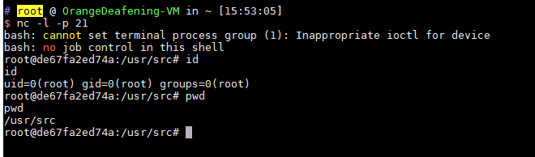

# Python PIL 远程命令执行漏洞（GhostButt ）

Python中处理图片的模块PIL（Pillow），因为其内部调用了GhostScript而受到GhostButt漏洞（CVE-2017-8291）的影响，造成远程命令执行漏洞。

漏洞详情：

 - http://blog.neargle.com/2017/09/28/Exploiting-Python-PIL-Module-Command-Execution-Vulnerability/

## 漏洞简述

PIL内部根据图片头（Magic Bytes）判断图片类型，如果发现是一个eps文件（头为`%!PS`），则分发给`PIL/EpsImagePlugin.py`处理。

在这个模块中，PIL调用了系统的gs命令，也就是GhostScript来处理图片文件：

```python
command = ["gs",
            "-q",                         # quiet mode
            "-g%dx%d" % size,             # set output geometry (pixels)
            "-r%fx%f" % res,              # set input DPI (dots per inch)
            "-dBATCH",                    # exit after processing
            "-dNOPAUSE",                  # don't pause between pages,
            "-dSAFER",                    # safe mode
            "-sDEVICE=ppmraw",            # ppm driver
            "-sOutputFile=%s" % outfile,  # output file
            "-c", "%d %d translate" % (-bbox[0], -bbox[1]),
                                            # adjust for image origin
            "-f", infile,                 # input file
            ]

# 省略判断是GhostScript是否安装的代码
try:
    with open(os.devnull, 'w+b') as devnull:
        subprocess.check_call(command, stdin=devnull, stdout=devnull)
    im = Image.open(outfile)
```

虽然设置了`-dSAFER`，也就是安全模式，但因为GhostScript的一个沙盒绕过漏洞（GhostButt CVE-2017-8291），导致这个安全模式被绕过，可以执行任意命令。

另外，截至目前，GhostScript官方最新版9.21仍然受到这个漏洞影响，所以可以说：只要操作系统上安装了GhostScript，我们的PIL就存在命令执行漏洞。

## 漏洞测试

运行环境：

```
docker-compose up -d
```

运行后，访问`http://your-ip:8000/`即可看到一个上传页面。正常功能是我们上传一个PNG文件，后端调用PIL加载图片，输出长宽。但我们可以将可执行命令EPS文件后缀改成PNG进行上传，因为后端是根据文件头来判断图片类型，所以无视后缀检查。

比如[poc.png](poc.png)，我们上传之，即可执行`touch /tmp/aaaaa`。将POC中的命令改为反弹命令，即可获得shell：


