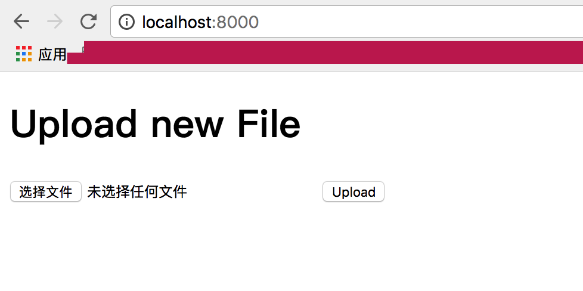
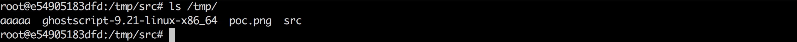

# Python PIL (Python Image Library) 命令执行漏洞 

## 原理

参考文章：

- https://github.com/neargle/PIL-RCE-By-GhostButt/blob/master/Exploiting-Python-PIL-Module-Command-Execution-Vulnerability.md
- [https://github.com/ArtifexSoftware/ghostpdl-downloads/releases/download/gs921/ghostscript-9.21-linux-x86_64.tgz](https://github.com/ArtifexSoftware/ghostpdl-downloads/releases/download/gs921/ghostscript-9.21-linux-x86_64.tgz)
- [https://paper.seebug.org/310/](https://paper.seebug.org/310/)


## 测试

编译及运行测试环境：

```
docker-compose build
docker-compose up -d
```

访问 http://localhost:8000/ 上传 poc.png



可以发现 payload `touch /tmp/aaaaa` 中的文件已经创建成功了。




