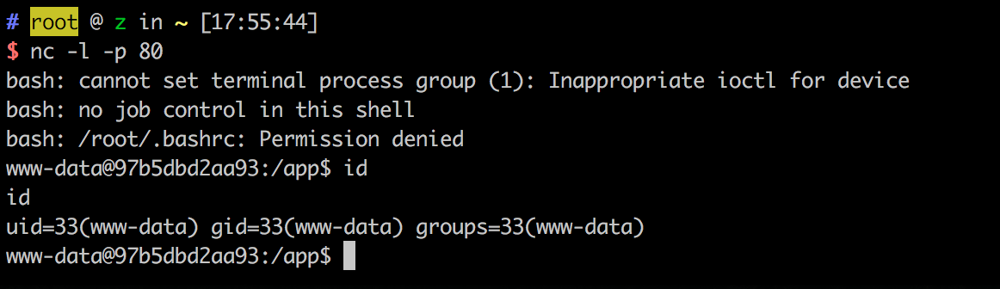

# Python unpickle 造成任意命令执行漏洞

## 原理

参考文章：

 - http://rickgray.me/2015/09/12/django-command-execution-analysis.html
 - https://www.leavesongs.com/PENETRATION/zhangyue-python-web-code-execute.html

## 测试

编译及运行测试环境：

```
docker-compose build
docker-compose up -d
```

访问`http://your-ip:8000`，显示`Hello {username}!`。username是取Cookie变量user，对其进行base64解码+反序列化后还原的对象中的“username”变量，默认为“Guest”，伪代码：`pickle_decode(base64_decode(cookie['user']))['username'] or 'Guest'`。

调用exp.py，反弹shell：

