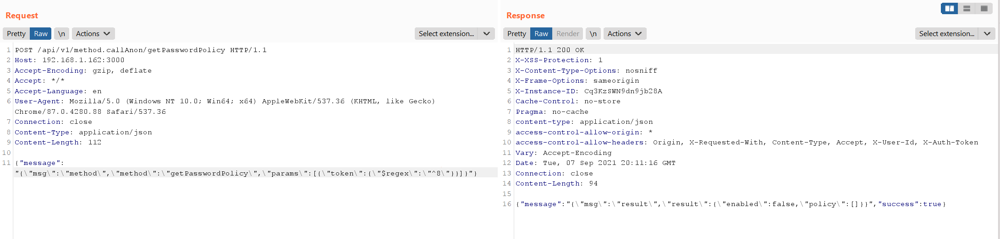

# Rocket Chat MongoDB 注入漏洞（CVE-2021-22911）

Rocket Chat是一款基于Node.js、MongoDB的开源团队聊天工具。在其3.12.1~3.13.2版本中，存在一处MongoDB注入漏洞，利用这个漏洞，攻击者可以获取用户敏感信息，甚至在服务器上执行任意命令。

这个漏洞有两种攻击方式：

- 未授权攻击者可以利用这个漏洞，获取任意普通用户的Password Reset Token，并通过这个Token修改其密码
- 普通用户可以利用这个漏洞，获取任意用户的任意信息

参考链接：

- https://blog.sonarsource.com/nosql-injections-in-rocket-chat
- https://www.exploit-db.com/exploits/50108
- https://github.com/CsEnox/CVE-2021-22911
- https://paper.seebug.org/1652/

## 环境搭建

执行如下命令启动一个Rocket Chat 3.12.1：

```
docker-compose up -d
```

环境启动后，访问`http://your-ip:3000`即可查看到Rocket Chat的安装向导，跟随向导进行安装即可。

安装完成后，为了验证第一个攻击方法，我们需要在后台增加一个普通用户，用户名为`vulhub`，邮箱为`vulhub@vulhub.org`。

## 漏洞复现

我们只来复现第一种利用方式。复现这个漏洞需要三步：

1. 通过邮箱找回密码，后台会在数据库中会生成Password Reset Token
2. 利用MongoDB注入，获取这个Password Reset Token
3. 使用Password Reset Token来更改这个用户的密码

其中，我们使用`$regex`语句进行MongoDB注入，当`$regex: ^7`时，不匹配，返回一个错误信息：


当`$regex: ^8`时能够匹配，返回正确信息：



将注入的过程通过[CVE-2021-22911.py](CVE-2021-22911.py)这个小脚本进行实现，自动化获取Password Reset Token：


使用Password Reset Token修改用户密码成功：


