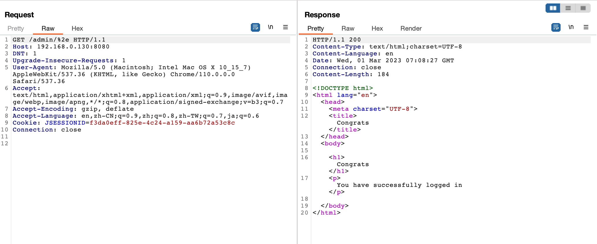

# Apache Shiro Authentication Bypass Vulnerability (CVE-2020-17510)

Apache Shiro is a powerful and easy-to-use Java security framework that performs authentication, authorization, cryptography, and session management.

Apache Shiro before 1.7.0, in some cases, using the character "." (%2e) can bypass Shiro's authorization.

References:

- <https://github.com/apache/shiro/commit/6acaaee9bb3a27927b599c37fabaeb7dd6109403>
- <https://xz.aliyun.com/t/11633#toc-37>
- <https://cve.mitre.org/cgi-bin/cvename.cgi?name=CVE-2020-17510>

## Vulnerable Environment

Start an application with Spring and Shiro 1.6.0 by executing the following command.

```
docker-compose up -d
```

Once the environment is started, visit ``http://your-ip:8080`` to see the home page.

## Vulnerability Reproduce

A direct request to the admin page `/admin/6` is inaccessible and will be redirected to the login page.


Construct a malicious request `/admin/%2e` to bypass authentication checks and access the admin page.


