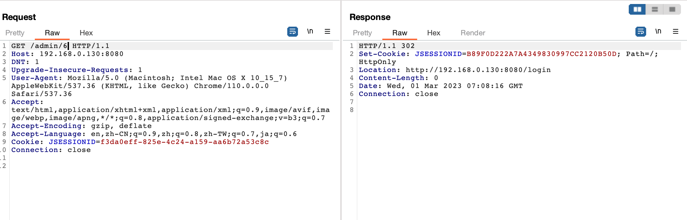
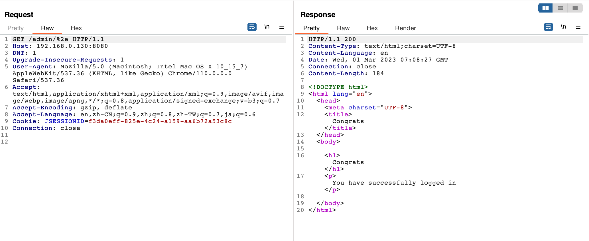

# Apache Shiro 认证绕过漏洞（CVE-2020-17510）

Apache Shiro是一款开源安全框架，提供身份验证、授权、密码学和会话管理。Shiro框架直观、易用，同时也能提供健壮的安全性。

在Apache Shiro 1.7.0以前的版本中，使用字符 .（%2e) 在某些情况下可以绕过Shiro 的权限验证。

参考链接：

- <https://github.com/apache/shiro/commit/6acaaee9bb3a27927b599c37fabaeb7dd6109403>
- <https://xz.aliyun.com/t/11633#toc-37>
- <https://cve.mitre.org/cgi-bin/cvename.cgi?name=CVE-2020-17510>

## 环境搭建

执行如下命令启动一个搭载Shiro 1.6.0的应用：

```
docker-compose up -d
```

环境启动后，访问`http://your-ip:8080`即可查看首页。

## 漏洞复现

直接请求管理页面`/admin/6`，无法访问，将会被重定向到登录页面：



构造恶意请求`/admin/%2e`，即可绕过权限校验，访问到管理页面：


