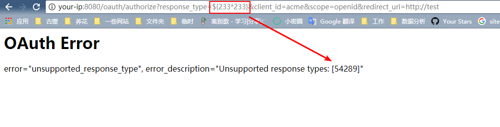
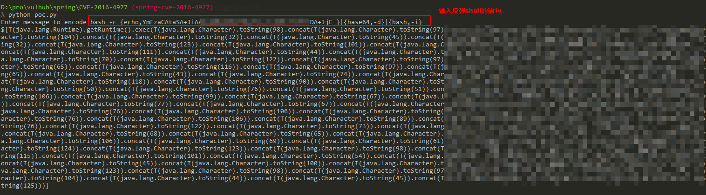
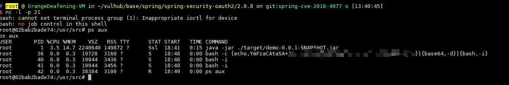

# Spring Security OAuth2 远程命令执行漏洞（CVE-2016-4977）

Spring Security OAuth 是为 Spring 框架提供安全认证支持的一个模块。在其使用 whitelabel views 来处理错误时，由于使用了Springs Expression Language (SpEL)，攻击者在被授权的情况下可以通过构造恶意参数来远程执行命令。

参考链接：

- http://secalert.net/#CVE-2016-4977
- https://deadpool.sh/2017/RCE-Springs/
- http://blog.knownsec.com/2016/10/spring-security-oauth-rce/

## 运行环境

执行如下命令启动漏洞环境：

```
docker-compose up -d
```

启动完成后，访问`http://your-ip:8080/`即可看到web页面。

## 漏洞复现

访问`http://your-ip:8080/oauth/authorize?response_type=${233*233}&client_id=acme&scope=openid&redirect_uri=http://test`。首先需要填写用户名和密码，我们这里填入`admin:admin`即可。

可见，我们输入是SpEL表达式`${233*233}`已经成功执行并返回结果：



然后，我们使用[poc.py](poc.py)来生成反弹shell的POC（注意：[Java反弹shell的限制与绕过方式](http://www.jackson-t.ca/runtime-exec-payloads.html)）：



如上图，生成了一大串SpEL语句。附带上这个SpEL语句，访问成功弹回shell：


